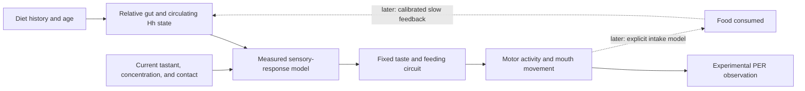

# From the original fly idea to a testable gut–taste experiment

**Project synthesis, real-data mapping, and practical value · 26 September 2026**

## The initial idea and the experiment it became

**Current priority:** the later [search for alternative experiments](alternative-experiment-proposals.md) recommends a visual neural benchmark first, with compass dynamics and feeding motor sequencing as alternatives. This report preserves the Hedgehog proposal and its unresolved requirements for possible later work; it is no longer the recommended first implementation.

The original idea was to give a connectome-based fly model the biological context that wiring alone cannot provide: sensory organs, muscles, internal physiology, and chemical signals. Actions would change the body and environment, which would then change subsequent neural input. A later ambition was to study interactions between multiple such animals. This remains a research direction, not a completed biological clone.

The proposed first example is smaller: **the same sugar stimulus produces a different feeding response after a different dietary history, mediated in part by a gut signal.** The existing taste-to-mouth loop in fly-brain-feeding is a candidate engineering substrate for a bounded physiological extension. Its moving mouth and contact sensing already exist; our intended contribution is the measured physiological connection and its evaluation.

The subsequent [critic review](experiment-critique.md) narrows the immediate recommendation to a **small feasibility and model-comparison study before extending embodiment**. First select compatible measurements and compare a history-dependent sensory model with a simpler explanation. Adding the neural circuit should serve a separately justified downstream prediction. Neither an intake-driven Hh cycle nor quantitative feeding behavior is established by the current prototype.

The newer dopamine/Doom idea explores the same broader principle: change a defined chemical mechanism and observe how neural processing and behavior change. Our review recommends octopamine as a candidate for a visual-motion assay and dopamine for a learning assay. Those alternatives and their validation criteria are documented in the [neuromodulation report](neuromodulation-doom-experiment.md). They are alternatives to prioritize, not additional requirements for the first Hedgehog prototype.

The shared scientific standard is **prediction of biological measurements withheld from fitting, using a fixed model and readout**. A successful animation, a programmed feedback effect, or a better game score cannot establish that standard by itself. The [main report](session-research-report.md) preserves the complete project history and repository review.

## 1. What real Hedgehog data are available?

Zhao and colleagues' 2022 study supplies the biological starting point and an actual Excel source-data workbook. We downloaded the workbook from the publisher and through Europe PMC, verified that their bytes match, and inspected all ten worksheet inventories. This is now a data inspection, rather than only a review of the paper's conclusions. [Primary study](https://pmc.ncbi.nlm.nih.gov/articles/PMC9763350/), [publisher source workbook](https://media.springernature.com/full/springer-static/esm/art%3A10.1038%2Fs41467-022-35527-4/MediaObjects/41467_2022_35527_MOESM3_ESM.xlsx)

The workbook is `41467_2022_35527_MOESM3_ESM.xlsx`, 10,600,824 bytes. Its SHA-256 is `41deeecbecbcc97d0c1336c4b1aaf009b3723b93c396086c0cc0ba1fb4866667`. Worksheets cover Figures 1–7 and supplementary Figures S2, S4, and S5. The [audit](hedgehog-data-audit.json) pins the source, selected exports, transformations, and compatibility issues. Published data are credited to Zhao et al. under [CC BY 4.0](https://creativecommons.org/licenses/by/4.0/); our CSVs are selected and reformatted extracts.

The measurements occupy different places in the proposed model:

| Measurement | Source location | Role in our experiment | What it does not directly supply |
|---|---|---|---|
| Diet-dependent PER curves | Figures 1 and 2 | Behavioral targets and intervention tests | Sensory firing or ingested food volume |
| Relative gut Hh expression over time and diet switches | Figure 3 | Constraints on a history-dependent gut-state model | Circulating protein concentration or secretion rate |
| Relative circulating Hh protein | Figure 4d/f | Constraints on endocrine state and partial genetic suppression | Absolute concentration at taste receptors |
| Local sensory-pathway reporter measurements | Figure 6h/i | Constraints on where the endocrine effect acts | A complete molecular signaling model |
| Labellar sensory responses to L-glucose | Figure 7b | A measured concentration–sensory-response relationship | A sucrose response curve or identified connectome neuron IDs |
| Food-choice measurements | Figure 7h | A possible later behavioral target | A direct readout of proboscis extension or total calories |

The source-data file contains numerical observations, not a ready-made simulator input stream. We must preserve the distinction between an experimental input, a hidden physiological state, a neural response, and a behavioral measurement.

## 2. The practical connection to the neural model

The proposed mapping is:

The dataset constrains the arrows. It does not replace the connectome or become a list of neural weights.

### Step A: keep diet history separate from the test stimulus

Record previous dietary sucrose fraction, exposure duration, age, genotype, and manipulation separately from the chemical and concentration touching the mouth during the assay. A fly raised on a high-sugar diet can still receive exactly the same test droplet as a control fly. That comparison isolates a state-dependent response.

A useful analysis table would carry `source_panel`, `source_cell`, `genotype`, `sex`, `age`, `diet_history`, `stimulus_molecule`, `stimulus_concentration`, `measurement`, `unit`, `replicate_group`, and `fit_or_evaluation`. Unknown metadata should remain unknown until resolved; do not fill it by assuming that separate figure panels describe the same flies.

### Step B: represent Hedgehog using the units the data support

Use a relative endocrine state initially. Figure 4 contains normalized protein measurements, while Figure 3 expression values are plotted on a log10 relative-expression scale. Neither provides an absolute hormone concentration in the extracellular fluid around a taste neuron. Negative values in the expression sheet are not negative protein concentrations.

The model should distinguish circulating gut-derived Hh from local signaling within taste neurons. The first prototype can restrict its claim to gut interventions with the local pathway otherwise intact. Extending to local-pathway manipulations requires a separate mechanism; one global Hh variable cannot silently represent both compartments.

Model RNA interference as the measured or uncertain degree of suppression, not automatically as complete removal. For example, the selected Figure 4f values average approximately 0.17 for the gut Hh-knockdown group versus a normalized control mean of 1.00. These are relative protein values within that comparison, not a universal dosage conversion. Figure 4d uses a different comparison and should retain its own normalization context. [Exported protein measurements](data/hedgehog-protein-fig4.csv)

Timing also changes the interpretation. Gut Hh overexpression throughout development increased PER, whereas adult-restricted overexpression suppressed it. Adult-only knockdown also had an effect. A model of specified adult conditions can therefore be useful, but a universal Hh-to-sweetness slider cannot represent every intervention. Preserve developmental and dietary history, and do not infer meal-by-meal secretion kinetics from expression measurements. [Zhao et al., 2022](https://pmc.ncbi.nlm.nih.gov/articles/PMC9763350/)

### Step C: turn a chemical stimulus and state into sensory activity

Define a small sensory-response function that depends on tastant identity, concentration, contact, and the relative physiological state. Compare plausible forms—such as a sensitivity shift versus a change in response magnitude—using measurements. Do not choose its parameters by making the animated fly eat more or less.

Figure 7b illustrates the available neural target. At 100 mM L-glucose, the source entries average **75.36 evoked spikes per three seconds** for the control and **121.71** for gut Hh knockdown. Dividing by three gives **25.12 and 40.57 mean evoked spikes per second**, respectively. These are descriptive calculations from 11 and 7 sensillum records, not new experiments or independent fly counts. The analysis must retain the recording hierarchy and distinguish evoked response from spontaneous firing. [Exported sensory observations](data/hedgehog-sensory-fig7b.csv)

In the existing repository, `body.js` produces a fixed 200 Hz stimulus during sugar contact. `model.js` uses that rate for stochastic input events into selected neurons, and caps the input at 200 Hz. An event rate is not guaranteed to equal the neuron's resulting output spike rate. We would replace the fixed-contact assumption and calibrate the resulting sensory-neuron response, checking for clipping and network feedback. We must also establish which modeled gustatory cells correspond to the measured organ and sensory class; one sensillum's rate cannot simply be copied into every sweet neuron. [Pinned body interface](https://github.com/dicnunz/fly-brain-feeding/blob/86c7d84fccb1269842c8520846fc006a79fb3487/body.js), [neural input implementation](https://github.com/dicnunz/fly-brain-feeding/blob/86c7d84fccb1269842c8520846fc006a79fb3487/model.js)

The three-second averages also leave temporal encoding uncertain. A burst and a sustained response can share the same mean; correlations across sensory cells can change downstream activity. Independent Poisson stimulation is an assumption to justify or vary, not a spike train supplied by this dataset. A conclusion that changes across plausible encoders must retain that uncertainty.

### Step D: let the circuit produce the response

Keep the chosen circuit dynamics fixed across experimental conditions. Changed sensory activity then propagates through the network and affects the motor output. Do not add a separate rule saying that the high-sugar condition should directly suppress mouth movement.

An observation rule converting the simulated response to the assay's endpoint needs independent support before quantitative behavioral validation. The published PER protocol scores full extension in three presentations per fly, producing per-fly values of 0%, 33.3%, 66.7%, or 100%. A normalized joint position of 0.7 is not a 70% probability of responding. The simulated assay must define an extension event, repeat the appropriate trial schedule, and aggregate comparable observations. [Assay methods](https://pmc.ncbi.nlm.nih.gov/articles/PMC9763350/)

MN9 controls rostrum lifting, one component of proboscis movement. Shiu explicitly identifies its firing-to-movement probability relationship as unknown. Fitting a threshold on the prototype's simplified mechanics could absorb the effect we intend to explain; freezing that threshold afterward would not establish its biological correctness. Report MN9 activity as an intermediate model output until the connection to the full-extension endpoint is justified. [Shiu et al., 2024](https://pmc.ncbi.nlm.nih.gov/articles/PMC11446845/), [critical assessment](experiment-critique.md#2-hedgehog-the-input-and-output-interfaces-could-determine-the-result)

For an example behavioral target, Figure 1b's 100 mM sucrose entries average **16.24% PER after the 6% diet** and **2.78% after the 34% diet**, with 39 and 36 per-fly aggregates. Those values describe separate behavioral groups. They must not be treated as paired observations with the Figure 7 sensory measurements above. [Exported PER measurements](data/hedgehog-per-fig1b.csv)

## 3. The data compatibility work that comes first

The source inspection exposes practical limits that affect the experiment design:

- **Different tastants:** Figure 7b records responses to L-glucose; the main PER curves use sucrose. Matching numerical concentrations is insufficient. We need a justified molecule-specific encoder or compatible additional measurements before making a quantitative sensory-to-PER validation claim.
- **Different ages and assays:** the methods place PER four days after a diet switch and electrophysiology at 8–10 days of age. The exact histories must be aligned or modeled explicitly.
- **Different biological substrates:** the benchmark concerns males; fly-brain-feeding uses a female reconstruction. Cell correspondence and transfer need evaluation before claiming a matched biological model.
- **Different sampling units:** a molecular sample can pool animals, sensory recordings can share a fly, and PER contains repeated trials. Treating every spreadsheet number as an independent animal would misstate uncertainty.
- **Reused observations:** the Figure 1b 6% control block exactly repeats in Figure 3g. Selecting one panel for fitting and the other for testing would leak data. Split by genuine experimental provenance, not worksheet name alone.
- **Metadata inconsistencies:** Figure 3f contains apparent label-to-array inconsistencies relative to Figure 3e, and Figure 7f has a dietary label that disagrees with the published figure. The audit records these specific locations. Exclude ambiguous blocks until clarified; no automatic corrections have been applied.

These findings do not make the project unusable. They determine which claim can be evaluated first. A sensory-response benchmark can proceed separately from a behavioral benchmark. If compatible measurements cannot support their quantitative connection, label the combined demonstration as a constrained hypothesis and state the missing experiment.

The workbook does not provide simultaneous Hh concentration, sensory firing, and behavior measured in the same individual. Linking its layers is therefore a modeling task with uncertainty, not an observed one-to-one relationship. Several physiological functions may fit the available comparisons. We should compare those alternatives rather than interpret one fitted curve as a uniquely identified molecular mechanism.

## 4. A staged experiment with a clear evidence boundary

| Stage | What we would implement | What it could establish |
|---|---|---|
| Data and assay alignment | Audited measurements, units, biological conditions, cell mapping, and evaluation split | A defensible benchmark; this report completes only an initial extraction and compatibility review |
| Feasibility and competing explanations | Compare a small history-dependent sensory model with a simpler diet-to-response model | Whether the measurements distinguish these explanations and justify a downstream circuit experiment |
| Sensory-state replay | Feed calibrated sensory responses for defined states into one fixed circuit | Whether measured input changes can account for selected downstream effects; replay alone does not validate Hh production |
| Explicit Hh-mediated state model | Predict sensory changes from relative Hh and history, instead of loading condition-specific responses | A test of the proposed physiological mediator if it predicts reserved measurements |
| Behavioral validation | Use one independently calibrated PER observation rule across conditions | Agreement with the named feeding-initiation assays if compatibility issues are resolved |
| Dynamic intake feedback | Model consumption and how it changes later physiology | A body–brain feedback hypothesis requiring additional temporal and intake validation |

For the first quantitative comparison, fit a limited set of parameters to declared sensory and baseline measurements; freeze the model; then test compatible concentrations, histories, or gut interventions excluded from fitting. Keep genetic controls and normalization contexts explicit. A genotype whose sensory response helped fit the model can still supply a separate behavioral test, but only when the observation mapping and assay transfer are independently constrained.

Compare against a simple sensory-to-PER response model and a version with fixed physiology. If claiming that anatomical wiring is necessary, include suitable wiring controls under a fair calibration budget. A simple model performing equally well is an informative result: it limits the role that we can attribute to the connectome.

The stronger circuit claim requires a prediction that depends on its wiring, preferably a cell-specific intervention. If interfaces already determine the observed effect, a large graph may add no explanatory value. Failed prediction also does not by itself disprove Hh biology or identify the missing component; it challenges the combined model, including its encoder and observation rule. [Critic's decision criteria](experiment-critique.md#6-smallest-defensible-experiments-and-decision-criteria)

Because we have inspected the published patterns, these are retrospective tests with data withheld from calibration, not blind predictions of unknown findings. Stronger evidence would come from recording a new prediction and then testing it in another experiment. The protocol and acceptance criteria should be fixed before evaluating the reserved data. The [neuromodulation validation section](neuromodulation-doom-experiment.md#9-how-we-would-establish-scientific-grounding) states the common standard in more detail.

## 5. Will the hormone participate in a feedback cycle?

That is the long-term intention, but two loops need separate treatment. The existing fast loop is contact → neural activity → mouth movement → changed contact. The proposed physiological loop adds actual intake, a gut state, and a later change in sensory responsiveness.

The paper's diet-history observations support investigating a slow, history-dependent mechanism. They do not specify all release, transport, receptor, clearance, and consumption dynamics needed for a continuously feeding virtual animal. Replaying measured diet histories is a useful intermediate stage; it is not evidence that an intake-driven loop has been validated.

A diet's sugar percentage also does not specify how much an animal consumed. PER measures initiation rather than ingestion. Continuous feedback therefore requires an explicit consumption model and suitable data. Begin with measured states and history-switch comparisons before adding an assumed kinetic equation. Display simulated time honestly if the visual demonstration accelerates a multiday history. Feedback does not necessarily imply oscillation, repeated feeding cycles, or a rapid post-meal satiety response.

## 6. What is the practical value?

### A research tool for deciding what explains behavior

The eventual circuit question is whether a measured change at the sensory periphery is sufficient, through an unchanged feeding circuit, to explain the behavioral change. First establish whether compatible measurements and independently supported interfaces make that test possible. A mismatch could motivate investigation of sensory mapping, motor readout, additional central modulation, or omitted physiology, but would not identify which component failed on its own.

A validated model could compare candidate explanations under the same conditions and identify experiments where their predictions diverge. For example, different models of physiological history might predict different responses after a diet switch or partial gut-signal suppression. Selecting a discriminating experiment could make laboratory work more focused. Such screening is useful only within validated conditions and with uncertainty; it cannot replace confirmation in animals.

### A reusable benchmark for adding physiology to connectomes

The practical software deliverable would be an auditable path from a measured physiological manipulation to neural input and behavior, with versioned data, a fixed circuit, controls, and an explicit observation rule. Other simulators could use the same benchmark to test whether a larger graph or a more detailed physiological model improves prediction.

The extraction completed here is a small first artifact: selected protein, sensory, and behavioral data are now in machine-readable tables with source-cell provenance. It makes the next modeling work concrete and exposes incompatibilities before those assumptions disappear into code.

### A demonstration whose visible behavior has an explanation

The proposed demonstration would compare matched virtual flies given the same test stimulus after different dietary histories, with a gut-specific intervention as a causal comparison. It would show the modeled state, sensory response, circuit output, and experimental-versus-predicted PER curve. Viewers could see which quantities are measured, fitted, and independently predicted.

This is a credible way to explain how body state changes sensory input to a nervous system. Its scientific contribution must come from quantitative evaluation or a useful new prediction. Rediscovering the published qualitative Hedgehog effect in an animation would not by itself be new biological knowledge.

### A bounded foundation for the broader idea

A later study from the same group reports that gut Hh has different effects on sweet and fatty-acid perception, while another signal, Upd2, participates in fat-dependent regulation. That provides a possible future challenge to a generic hunger scalar, but adding it requires its own sensory and physiological mechanisms. It is a 2023 paper, although its PMC manuscript became available in 2024. Its data statement offers the reported data on request; we have not acquired them. [Zhao et al., 2023](https://pubmed.ncbi.nlm.nih.gov/37934669/)

Our immediate value proposition is a **testable model of a specific body-to-sensory mechanism**. Human treatment predictions, general drug screening, full-organism cloning, and population-collapse simulations would require substantial additional evidence. The gut–taste experiment could contribute one validated component toward the larger vision; it cannot establish the rest of that vision by itself.

## Current deliverables and status

- [Critical review](experiment-critique.md): strongest objections, revised priorities, minimum experiments, and conditions for proceeding or narrowing the claim.
- [Main session report](session-research-report.md): original idea, repository findings, project choices, and scientific boundaries.
- [Neuromodulation report](neuromodulation-doom-experiment.md): dopamine/Doom and octopamine alternatives, with validation criteria.
- [Hedgehog data audit](hedgehog-data-audit.json): pinned workbook, source inventory, metadata issues, and example summaries.
- [PER extract](data/hedgehog-per-fig1b.csv), [sensory extract](data/hedgehog-sensory-fig7b.csv), and [protein extract](data/hedgehog-protein-fig4.csv): 1,164 selected measurement entries in total, not 1,164 independent animals.
- [Extraction script](extract_hedgehog_data.py): reproduces these tables from the pinned workbook using Python's standard library.

We have inspected and extracted source data. We have not fitted the proposed physiological model, run a Hedgehog simulation, resolved all assay-transfer questions, or completed biological validation. The HTML presentation remains unchanged.
