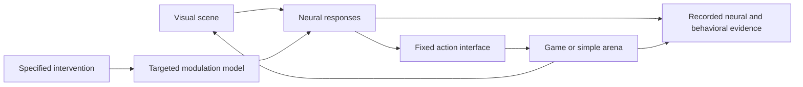

# Same connectome, different chemical state

**Research assessment and proposed experiment · 26 September 2026 · Firebird**

## The idea and our recommendation

**Current priority:** the subsequent [broader experiment search](alternative-experiment-proposals.md) recommends first reproducing a defined visual-circuit response against actual neural measurements. Chemical modulation remains a possible extension requiring separate evidence. The proposal-specific analysis below is preserved; no neuromodulation model has been implemented or validated.

We can compare the same fly neural model under different modeled chemical states and show the resulting behavior in Doom. This can be a useful computational neuroscience experiment. Its scientific value depends on independently testing the chemical mechanism and the relevant neural responses; a difference in game scores alone establishes an effect in our simulator.

For a visual demonstration, our preferred candidate is **octopamine and visual motion processing**. For a learning experiment, **compartment-specific dopamine modulation** is well motivated, but the existing Doom project already attempts it and reports failed validation. Tyramine deserves a separate, behavior-specific experiment. Cortisol is a poor starting point for this adult fly brain model.

The initial [critic review](experiment-critique.md) recommended **deferring dopamine–Doom and assessing octopamine in an established visual model or smaller circuit first**. A fixed game decoder permits a controlled agent comparison but does not make its score a biological endpoint. At that stage the project priority was a small Hedgehog feasibility study; the broader search linked above has since changed the recommended starting point.

This is an alternative to the earlier gut–Hedgehog proposal, not a decision to build both. The feeding prototype remains the more direct engineering starting point for that proposal. No neuromodulation experiment has been implemented or run in this workspace. This follow-up updates written reports only; the HTML presentation remains the earlier snapshot.

The [project synthesis and Hedgehog data report](hedgehog-experiment-data-and-value.md) now documents the initial whole-organism idea, the available source measurements, the practical data-to-model connection, and the value of the narrower experiment. The validation criteria in Section 9 below apply to both directions, with assay-specific benchmarks.

## 1. What DOOMFLY already implements

We inspected [nftechie/doomfly at commit 71ecf53](https://github.com/nftechie/doomfly/tree/71ecf53d78eaffaf1a57ed7b0ccf5d458abc9f33), including its current protocol, neural code, learning rule, and historical results. Its current README describes a connectome simulation driving a fixed game interface. It explicitly reports that candidate v6 failed its visual, conditioning, and survival validation gates. These are the authors' results; we did not rerun the full simulation. [Pinned README](https://github.com/nftechie/doomfly/blob/71ecf53d78eaffaf1a57ed7b0ccf5d458abc9f33/README.md)

The experimental mode already delivers damage-triggered stimulation to two dopamine neurons, PPL101 IDs 11327 and 11900. Each pulse adds 4 mV-equivalent drive for 200 ms. Activity in those neurons and Kenyon cells—the mushroom body's intrinsic neurons—updates 4,184 existing connections onto MBON11 output neurons. This is artificial neural stimulation coupled to a learning rule, not an injected dopamine concentration. The current live protocol also carries neural and memory state across game deaths. [Training protocol](https://github.com/nftechie/doomfly/blob/71ecf53d78eaffaf1a57ed7b0ccf5d458abc9f33/docs/doom-live-training.md)

The rule adapts published memory modeling, with chosen trace durations, weight bounds, and decay. The implementation itself calls transfer to this male reconstruction a hypothesis. A literature-derived equation becomes a new model when its parameters, network, and inputs change. [Implemented rule](https://github.com/nftechie/doomfly/blob/71ecf53d78eaffaf1a57ed7b0ccf5d458abc9f33/doom_learning_v6/rule.py)

There is also a subtle implementation boundary: v6 separates cells annotated dopamine, octopamine, or serotonin from ordinary fast synaptic transmission. Their outgoing contacts accumulate a modulation trace, but that generic trace has no implemented receptor-specific effect on target excitability. The operative learning update uses selected dopamine-cell firing rates separately. Therefore, the presence of an octopamine annotation or trace does not supply an octopamine visual-response model. [Brain implementation](https://github.com/nftechie/doomfly/blob/71ecf53d78eaffaf1a57ed7b0ccf5d458abc9f33/doom_learning_v6/brain.py), [native kernel](https://github.com/nftechie/doomfly/blob/71ecf53d78eaffaf1a57ed7b0ccf5d458abc9f33/doom_learning_v6/kernel.cpp)

The historical experiments reveal why controls matter. Candidate v5 suppressed a cue response equally with and without imposed punishment. Candidate v6 retained substantial activity after a visual stimulus ended. These results undermine an interpretation based on selective associative learning or calibrated visual recovery. Earlier documents describing a fixed, non-learning baseline must be read alongside the later v6 training protocol. [Iteration log](https://github.com/nftechie/doomfly/blob/71ecf53d78eaffaf1a57ed7b0ccf5d458abc9f33/docs/doom-learning-iteration-log.md)

**Our potential contribution is a calibrated intervention and controlled evaluation. Adding a dopamine switch by itself is already covered by this prior work.**

## 2. Which chemicals have a useful biological basis?

| Candidate | Suitable first question | Assessment for this project |
|---|---|---|
| Dopamine | Does a specified signal, delivered at a specified time, alter cue-specific memory? | Strong biological motivation; existing implementation needs validation |
| Octopamine | Does a specified modulatory state change visual responses to moving stimuli? | Best candidate for a rapid, visually legible effect, conditional on a working visual model |
| Tyramine | How does internal state change a particular behavioral choice? | Plausible, but choose an adult assay before mapping it to game behavior |
| Cortisol | Does an externally supplied steroid affect an identified fly pathway? | Separate pharmacology question; insufficient basis for a generic fly stress control |

### Dopamine: location and timing are part of the mechanism

In real flies, pairing an odor with activation of specific dopamine neurons can produce odor-specific depression of mushroom-body output synapses. The order of the events and the anatomical compartment matter. This supports a local learning mechanism, not a brain-wide rule that more dopamine improves performance. [Hige et al., 2015](https://pubmed.ncbi.nlm.nih.gov/26637800/)

There is direct evidence for visual associative learning too: Vogt and colleagues used colored cues with sugar or shock and identified roles for dopamine and mushroom-body circuitry. Their results depended on the task and recruited overlapping, partly distinct populations from olfactory learning. A Doom experiment still has to establish that its chosen visual cues reach the relevant modeled circuit. [Vogt et al., 2014](https://pmc.ncbi.nlm.nih.gov/articles/PMC4135349/)

Huang, Luo and colleagues investigated interactions between short- and long-term memory through dopamine and recurrent mushroom-body circuitry. This is the paper adapted by DOOMFLY, and its authors released voltage-imaging and behavioral data. It offers a possible quantitative calibration resource; we have not fitted or independently reproduced it. [Primary paper](https://pmc.ncbi.nlm.nih.gov/articles/PMC11525173/), [released data](https://zenodo.org/doi/10.5281/zenodo.10998456)

**Inference for our experiment:** distinguish brief, cue-timed dopamine-neuron activation from sustained exposure. Neither a score increase nor a beneficial direction of effect should be assumed in advance.

### Octopamine: a particularly good connection to vision

Suver and colleagues showed that applying octopamine to quiescent flies could mimic the increased motion responses seen during flight. Manipulating octopamine neurons supplied causal evidence for this state-dependent visual change. This is an unusually direct motivation for the user's idea of comparing chemical states. [Suver et al., 2012](https://pubmed.ncbi.nlm.nih.gov/23142045/)

Strother and colleagues localized state-dependent effects in the ON-motion pathway, including Mi4 inputs to T4 neurons. They measured altered visual tuning and sustained turning responses to fast motion. Some pharmacological experiments used the octopamine agonist chlordimeform, not octopamine itself; concentrations and preparations must not be conflated. Their walking behavior experiments used females, creating a transfer question for MaleCNS. [Strother et al., 2018](https://pmc.ncbi.nlm.nih.gov/articles/PMC5776785/)

The measurements do not uniquely identify a single gain mechanism: baseline shifts, response amplitude, and temporal filtering need to be distinguished, and the paper includes a simple motion-detector model as a useful comparison. Intervention scope also matters. Tdc2-GAL4 labels tyraminergic as well as octopaminergic cells; broad silencing is not equivalent to selectively removing octopamine action at Mi4. Preserve those distinctions when translating the experiment into a model. [Visual study](https://pmc.ncbi.nlm.nih.gov/articles/PMC5776785/), [driver scope](https://pmc.ncbi.nlm.nih.gov/articles/PMC11064449/)

**Inference for our experiment:** moving gratings provide a closer biological benchmark than killing enemies. Start with measured visual responses, then ask whether the resulting model change affects a game. Increasing Mi4 excitability is not equivalent to multiplying every neuron by the same gain, and improved game performance is not guaranteed.

### Tyramine: useful, but not a universal slowing signal

A mechanistic study links tyramine to reduced motor-neuron excitability through a receptor and calcium-current pathway, but those experiments concern larvae. Transferring that rule directly to adult game controls would be unsupported. [Larval motor study](https://pmc.ncbi.nlm.nih.gov/articles/PMC6397572/)

Adult evidence is richer than a simple octopamine-versus-tyramine opposition. Genetic manipulations of their synthesis produced different effects on adult locomotion and fertility. Separately, an adult male study connected tyramine and nutritional state to the choice between feeding and courtship, with different effects on identified neural populations. That is a better candidate for a later internal-state experiment than assigning tyramine a Doom movement penalty. [Hardie et al., 2007](https://pubmed.ncbi.nlm.nih.gov/17638385/), [Cheriyamkunnel et al., 2021](https://pmc.ncbi.nlm.nih.gov/articles/PMC8538064/)

### Cortisol: a different question, with a necessary qualification

Cortisol is a vertebrate glucocorticoid hormone, not an established endogenous fly brain stress variable in the evidence reviewed here. It should not be added as a generic counterpart to dopamine or octopamine.

It would also be inaccurate to say that related steroids cannot affect flies. Bartolo and colleagues found that orally supplied **cortisone acetate** increased susceptibility to fungal infection, with a requirement for the fly estrogen-related receptor, dmERR. They did not establish a cortisol-to-adult-neural-performance pathway; direct steroid binding to dmERR remained a future question. Cortisone acetate exposure is not equivalent to a calibrated cortisol injection into brain tissue. [Bartolo et al., 2020](https://link.springer.com/article/10.1186/s12866-020-01848-x)

**Decision:** leave cortisol out of the first experiment. Studying a native fly stress or endocrine pathway would require selecting its own measured mechanism and behavioral endpoint.

## 3. What would “injection” mean in software?

| Intervention | What changes | Defensible interpretation |
|---|---|---|
| Stimulate identified transmitter-producing neurons | External current or firing in named cells | A modeled neural-activation experiment |
| Apply a modeled chemical exposure | Local concentration, clearance, receptor response, downstream effects | A pharmacological model, to the extent these parts are calibrated |
| Change a global gain or learning-rate parameter | Simulator equations across many cells | A sensitivity experiment on that parameter |

These interventions can yield different results. Neuron stimulation is not a measurement of transmitter concentration. A contact map and transmitter labels do not supply the missing receptor distribution, response curves, or release and clearance parameters. Co-transmission and effects beyond annotated synaptic contacts may also matter; the appropriate simplification depends on the chosen assay.

A credible first model can be small. It need not reproduce every molecular reaction or include a complete body. For example, a target-specific response curve fitted to an experimentally manipulated state can be useful if it predicts independent observations. Label its control “modeled octopamine state” or “stimulation intensity” when a physical concentration is not calibrated.

A possible later concentration model is:

```text
change in local concentration = modeled release + external exposure − clearance
target response = measured or fitted function of concentration and receptor state
```

This is a proposed modeling structure, not an equation recovered from the connectome. Choosing a decay constant or receptor-response curve without data does not make it measured pharmacology.

## 4. Proposed experiment A: octopamine and motion processing

**Question:** Can one fixed neural model predict how a defined modulatory intervention changes responses to moving visual stimuli, and what happens when that model controls an environment?

1. **Establish a baseline visual assay.** Present controlled moving gratings at several speeds and directions. Test responses, selectivity, and recovery after stimulus offset. Confirm meaningful stimulus-dependent output before adding game complexity. DOOMFLY's reported visual failure makes this a prerequisite, not an assumed capability.
2. **Implement one bounded mechanism.** Map relevant cells and fit a limited set of modulatory effects using a specified biological experiment. Record the sex, preparation, agonist or transmitter, and measurements. Do not fit to Doom scores.
3. **Test independent predictions.** Reserve stimulus conditions or intervention data before fitting. A model fitted to one visual response should predict another response or intervention that was not used to select its parameters. Digitized figure points carry measurement uncertainty; seek source data where possible.
4. **Separate sensory and behavioral effects.** Replay identical recorded frames to baseline and modulated models, with learning disabled. Then run closed-loop trials using the same fixed neural-to-action mapping. A plausible neural effect can exist even when the game mapping produces no useful benefit.
5. **Add a simple game scene.** Use a corridor with moving walls or a controlled motion task first. A Doom combat arena is a later generalization test. Wide-field motion processing does not itself demonstrate enemy recognition or target tracking.

The initial conditions should be baseline, increased modeled modulation, and a matched interruption of the specified modulation pathway. If receptors are not explicitly modeled, call the latter a pathway ablation rather than a receptor knockout. Add an activity-matched generic-gain control to test whether the proposed mechanism explains more than a nonspecific increase in activity.

This route has good biological motivation but is not a small cosmetic addition to the current Doom simulator. Visual physiology may require substantial revision, including reconsidering its spiking approximations for graded visual neurons. A separately validated visual model or smaller circuit may be a better substrate; that choice requires its own compatibility review.

Lappalainen and colleagues provide an existing connectome-constrained visual model with cell-specific response predictions. Assess that class of model before committing to repair DOOMFLY's visual system; its existing evidence does not automatically validate our proposed modulation. Compare excitability, temporal-filter, and generic-gain explanations under the same biological assay. [Lappalainen et al., 2024](https://www.nature.com/articles/s41586-024-07939-3)

## 5. Proposed experiment B: dopamine and visual memory

**Question:** Does changing a defined dopamine signal during training change later cue-specific behavior when imposed stimulation is absent?

Begin with two distinguishable visual cues. Establish their representations and baseline preference; counterbalance which cue is paired with an aversive event. Only then place them in a simple Doom choice arena. The neural-to-action mapping must be fixed before comparing interventions.

Separate two studies:

- **Acute performance:** freeze plasticity and vary stimulation. Measure immediate changes in sensing, movement, and game behavior.
- **Learning and retention:** permit the specified plasticity during training, then evaluate with imposed stimulation removed, matched neural state, and weights frozen. If modeling a chemical exposure, include its clearance before calling the probe drug-free. Preserve learned weights while controlling transient state consistently.

Compare no added stimulation, cue-paired pulses, and pulses with the same exposure delivered independently of the cue. A sustained condition is informative as a separate hypothesis, not an interchangeable “dose” of a brief event. Include frozen-plasticity and relevant pathway interventions; evaluate unfamiliar starting positions and reversed cue contingencies when feasible.

DOOMFLY's automatic damage-triggered dopamine must be disabled or held identical across branches unless it is the variable being studied. Reset full neural, memory, sensory-filter, and controller state between independent runs. Consecutive rounds from one continuously learning stream are not independent training replicas.

Passing a small conditioning assay would justify trying the larger game. Failure at that stage is a reason to investigate the model, not to search for a lucky combat episode.

## 6. Controls and measurements shared by both routes

| Potential confound | Proposed check |
|---|---|
| Different starting state explains the result | Restore the same documented initial state for each matched comparison |
| Intervention acts through the game adapter | Freeze adapter parameters; record neural output and resulting actions separately |
| More motion or firing inflates the score | Measure turning bias, movement, firing rate, damage, and task success separately |
| Vision is irrelevant to apparent success | Include blank or scrambled input and a simple controller baseline |
| Arousal is mistaken for memory | Separate acute tests from retention without imposed stimulation |
| Hand-picked episodes exaggerate evidence | Prespecify seeds, metrics, and analysis; report all independent runs |
| One uncertain physiological parameter determines the conclusion | Repeat the analysis over a justified parameter range |
| The connectome is credited without a comparison | If claiming a wiring advantage, include suitable topology and simpler-model controls |

Use paired starting seeds, but recognize that closed-loop actions soon produce different subsequent frames. Identical-input replay and interactive play answer different questions. Report effect sizes and uncertainty across independent model runs; thousands of frames from one run are not thousands of biological samples. Repeated runs of one reconstructed specimen also do not establish animal-to-animal generalization.

Freezing the neural-to-button mapping addresses a within-agent confound, not its biological meaning. Another reasonable mapping could turn the same neural change into a different game outcome. Record neural assay results separately from scores; assess interface sensitivity if claiming generality across engineered agents. A successful biological assay would support that assay's mechanism and scope, not a conclusion about how dopamine changes a living fly's Doom ability.

A pilot should estimate variability and runtime before selecting a final run count. Neither a universal performance-improvement prediction nor a required sample size has been established in this review.

## 7. What the demonstration would show

The proposed viewer would place two synchronized conditions beside each other: **baseline** and **the specified intervention**. Start with the simple assay, then offer game playback from the same experiment.

Display four linked observations:

1. The visual scene and the model's behavior.
2. The intervention's timing and actual modeled intensity or concentration.
3. Responses in the selected neural populations; for learning, the relevant weight changes.
4. Task measurements across repeated runs, including uncertainty and unsuccessful conditions.

This makes the causal question visible: where does the difference first appear, and does it persist into behavior? A representative replay should accompany the distribution of results. Animation speed must not silently change neural or chemical time, and anticipated improvements must not be scripted into the display.



The visual-action feedback loop already exists in a game interface. A physiological loop that controls transmitter release from internal state is an additional model. For the first comparison, externally controlled modulation is preferable because it isolates the intervention. Later, state-dependent release could be added and tested; a Doom movement command is not automatically a calibrated walking or flight state.

## 8. How this compares with gut–Hedgehog feedback

| Route | Main scientific question | Main implementation burden | Best demonstration |
|---|---|---|---|
| Gut–Hedgehog and taste | How does dietary history alter sweet response? | Add physiological state and calibration to the existing taste-to-mouth prototype | Matched sugar responses under different histories and gut interventions |
| Octopamine and vision | How does modulation change motion processing? | Obtain a reliable visual baseline and a bounded modulatory model | Moving scene, neural response, and matched behavioral traces |
| Dopamine and memory | How do signal timing and location affect learning? | Repair baseline and conditioning failures; separate training from acute effects | Cue learning, retention, and intervention controls |

The earlier recommendation was a small Hedgehog feasibility and model-comparison study before extending the feeding prototype. The [broader comparison](alternative-experiment-proposals.md) now recommends a visual neural benchmark first. Octopamine still needs a matched biological modulation assay. Defer dopamine–Doom until sensory discrimination and conditioning pass reproducibly, including retention, unpaired-exposure, and frozen-plasticity controls. A changed score or changed weights is insufficient. The [critic's decision table](experiment-critique.md#6-smallest-defensible-experiments-and-decision-criteria) specifies when to proceed or narrow each chemical-intervention claim. Implementing four interchangeable chemical sliders would obscure their different mechanisms.

## 9. How we would establish scientific grounding

**The strongest practical test is whether a fixed model predicts real biological measurements that were not used to tune it.** Relevant papers establish motivation. Correct code establishes that we implemented our equations. Fitting observed responses establishes calibration. Predicting additional measurements and interventions supplies evidence for the model within that tested scope. None establishes a complete fly emulation or a unique explanation of the biology.

### A concrete first benchmark

For the octopamine route, propose the narrow claim: *this model predicts selected changes in visual responses across motion speeds, stimulus durations, and a specified octopaminergic intervention.*

One candidate behavioral benchmark is Strother et al.'s Figure 3C: octopamine-neuron silencing especially impaired sustained turning to fast visual motion, with effects depending on presentation duration. The authors also acknowledge possible downstream and nonneural contributions. Reproducing this behavior would therefore not, by itself, establish Mi4 modulation as its sole cause. [Primary experiment](https://pmc.ncbi.nlm.nih.gov/articles/PMC5776785/)

The proposed test should proceed in this order:

| Step | Concrete deliverable | Requirement before advancing |
|---|---|---|
| Specify the assay | A versioned protocol with stimulus, intervention, cells, sex, preparation, observables, and intended claim | The simulated manipulation and biological experiment are comparable; unresolved male/female or agonist/transmitter transfers are explicit |
| Obtain benchmark data | Experimental traces or response curves with biological replicates and uncertainty | Data are usable for the intended comparison; figure digitization and missing raw data are disclosed |
| Calibrate a limited model | Fit chosen baseline and modulation parameters using a declared subset of neural measurements | Parameter choices and fitting data are recorded; the model has a meaningful baseline |
| Freeze the prediction | Commit parameters, sensory encoding, observation model, readout, analysis, and selected evaluation conditions | No condition-specific retuning after inspecting evaluation errors |
| Evaluate independent responses | Compare predicted and measured responses across conditions withheld from fitting | Agreement satisfies a predeclared error criterion and survives relevant alternative explanations |
| Test behavioral transfer | Predict the biological turning assay using an independently constrained steering readout | The same model explains the selected behavioral intervention without retuning the readout for the desired outcome |

First validate neural responses if a biological steering readout is unavailable. A Doom button mapping cannot stand in for measured fly turning. The neural and behavioral claims should remain separate until both pass their own comparisons.

Measurement units must also match. Calcium-indicator fluorescence, membrane voltage, and spike rate are different observables. If the experiment records calcium while the model produces spikes, define and independently constrain the conversion before comparing curves; do not hide discrepancies in a freely fitted observation filter. Reproduce the actual agonist or neural manipulation, or document and test the approximation used to represent it.

### Avoid a circular demonstration

Programming “octopamine increases visual gain” and then showing increased visual gain checks the encoded assumption. More informative tests ask whether that mechanism also predicts an independently measured temporal response, a stimulus condition withheld from fitting, or the magnitude and selectivity of an intervention effect.

Likewise, setting a modulation parameter to zero and observing that its effect disappears is a consistency check. Biological support comes from agreement with the corresponding experimental perturbation, including which responses remain intact. A broad disruption that eliminates all activity would not explain a selective biological deficit.

Because this review has already examined published qualitative findings, using those findings later is retrospective evaluation, not a blind prospective prediction. Reserve quantitative conditions from fitting, document what informed model design, and avoid repeatedly adapting to a supposed test set. A genuinely new prediction recorded before an independent experiment would provide stronger evidence.

### Predeclare what would count as failure

Select primary observables and an acceptance rule before final evaluation. For example, compare the intervention-induced change in response across speed and duration using an error measure whose scale is justified by biological variability and the intended use. Report effect sizes, uncertainty, and systematic discrepancies. Do not adopt a universal “90% accurate” threshold or treat a significant change in game score as sufficient.

Useful challenges include a simple fitted gain model, an otherwise matched model without the proposed pathway, and controls for altered baseline activity. Compare models using the same data split and a fair calibration procedure. If claiming that biological wiring adds predictive value, add constrained wiring controls that preserve relevant basic network properties. A simpler model performing equally well limits the wiring claim, even if both models predict the assay successfully.

For the chosen octopamine claim, failure examples include unexplained baseline dysfunction, the wrong dependence on stimulus conditions, excessive suppression of responses that remain in the biological control, or apparent agreement that requires a separate decoder for each condition. Repeated simulation runs estimate computational variability; evidence about variation between animals requires biological replicates and an appropriate population model.

For dopamine, an analogous benchmark concerns cue specificity and event timing. Hige et al. provide a biological target involving odor pairing and specific dopamine neurons; applying it to visual game learning requires a separate sensory-transfer test. A retention advantage should be measured after imposed stimulation ends and compared with unpaired exposure and disabled plasticity. [Dopamine timing and specificity](https://pubmed.ncbi.nlm.nih.gov/26637800/)

### Match the claim to the evidence obtained

| Evidence available | Claim it could support |
|---|---|
| Relevant anatomy, experiments, and explicit assumptions | A biologically motivated model proposal; this is our present stage |
| Accurate implementation and agreement with fitting data | A verified implementation calibrated to those measurements |
| Successful independent neural or behavioral comparisons, including relevant interventions | A model validated for the named assays and conditions, with stated error and limitations |
| A recorded new prediction subsequently confirmed in real flies | Stronger prospective support for the proposed mechanism; competing mechanisms still require comparison |
| Better Doom performance under the intervention | A result for this computational agent and interface; it does not independently validate fly biology |

We can begin with existing published data and do not need to run our own fly laboratory to obtain useful validation. A later collaboration could test one distinctive new prediction. Publishing the protocol, data provenance, runnable analysis, model version, baselines, and unsuccessful results would let another group challenge or reproduce the finding. Peer review and replication can strengthen confidence; neither replaces the biological comparisons.

The first evidence-focused visualization should overlay experimental measurements and model predictions, mark which conditions were used for fitting, and show errors for the reserved conditions. Doom playback can then illustrate what the tested mechanism does in an engineered environment.

## Evidence and reproducibility

Repository observations are pinned to the commit above. The associated [source audit](neuromodulation-source-audit.json) records inspected file hashes, literature access, and review limits. No Doom game trial, new neural simulation, pharmacological calibration, or biological replication was performed for this report. The 15 feeding-repository tests documented in the main report concern earlier work and do not validate this proposal.

The report distinguishes published measurements, inspected implementation behavior, and our proposed experiments. The separate critic-agent review and its additional literature references are documented in [experiment-critique.md](experiment-critique.md); that review also ran no simulations. Relevant uncertainties remain in receptor targeting, cell correspondence, visual physiology, exposure kinetics, and the behavior represented by the game interface. The next useful artifact would compare competing explanations on a small assay before presenting a viewer of the actual outputs. Prediction failure challenges the combined model but does not alone disprove the biological mechanism; prediction success does not uniquely identify it if alternatives agree.
