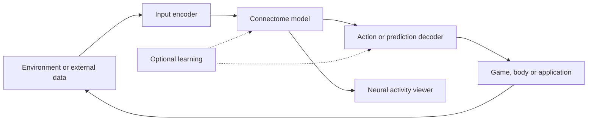

**Awesome Fly: review of all 96 linked repositories**

Reviewed on **25 September 2026**. Source collection: [cobanov/awesome-fly](https://github.com/cobanov/awesome-fly).

The collection brings together application experiments, scientific models, datasets and analysis infrastructure. Many projects use older female FlyWire data, larval data or synthetic circuits; they are not all applications of the September MaleCNS release. Similar names also hide different implementations, while several apparently different demos reuse the same neural engine.

This review covers every distinct repository linked directly from the collection's README, including its starter template, embedded repository cross-references and related lists. Repeated links count once. I retrieved and inspected a README and root file listing for each repository, then read selected methods, results, model cards and source files where important distinctions needed checking. I did not install the projects or rerun their experiments. Numerical results below are the authors' reports, with qualifications from their own documentation and selected source inspection. Linked papers and websites are context, and outgoing links from the 96 repositories were not recursively treated as additional catalog entries.

The companion [CSV](awesome-fly-repositories.csv) adds a reusable-contribution field for each entry. The [source audit](awesome-fly-review-sources.json) records source URLs, content hashes, observed repository commits, inspected files and coverage. Repository IDs below follow first appearance in the source list; entries are grouped by purpose here.

**What people have actually tried**

Four different uses of a connectome recur. Distinguishing them explains much more than counting simulated neurons:

| Approach | What changes during learning? | Examples |
|---|---|---|
| Fixed neural controller | Nothing; engineers choose inputs, gains and action mappings. | [Fly64](https://github.com/ornata/fly), [Fly Chess](https://github.com/tolatolatop/fly-chess), [Fly-NAF](https://github.com/ArtyMend07/Fly-NAF) |
| Fixed graph plus learned readout | A small decoder learns to turn neural features into actions or predictions. | [Fly Dino](https://github.com/cobanov/flyjump), [Fly Craftax](https://github.com/liuzihe02/fly-craftax), [FLM](https://github.com/nftechie/flm) |
| Modeled plasticity inside a circuit | Selected synapses change under an engineered local/reward rule. | [Fly Blackjack](https://github.com/WilliamJones/fly-blackjack), [FlyPong](https://github.com/jonatasperaza/FlyPong), [DOOMFLY](https://github.com/nftechie/doomfly) |
| Biological topology as an ML architecture | Trainable weights use a measured connection mask; dynamics can differ substantially from neurons. | [Train Your Fly](https://github.com/eudald-seeslab/train-your-fly), [Boltzmann Fly](https://github.com/jniimi/boltzmann-fly), [AxonWeave](https://github.com/dhakalnirajan/axonweave) |

Many interactive applications follow this approximate structure. The engineering outside the measured graph often determines much of the visible behavior:

**Results that change how to interpret the demos**

| Finding | What it establishes—and its boundary |
|---|---|
| [Fly Dino](https://github.com/cobanov/flyjump) reports 99/100 held-out courses completed. | A small trained controller works and depends on circuit activity. It does not show that biological wiring beats an equally sized alternative. |
| [Flyhard](https://github.com/MarkUnthank/flyhard) reports 100/100 steering-angle targets. | A learned body can physically steer a simulated wheel. The recorded car run still uses supplied turn targets and speed. |
| [Fly Craftax](https://github.com/liuzihe02/fly-craftax/blob/main/tracker.md) gains achievements after PPO training. | Its image-removal controls reveal little use of vision; the agent mostly follows an alternating action pattern. |
| [Fly Blackjack](https://github.com/WilliamJones/fly-blackjack) improves through modeled plasticity. | It learns a limited tendency to avoid busting. Its odor-learning experiment also works with shuffled KC-to-MBON wiring. |
| [FlyPong](https://github.com/jonatasperaza/FlyPong) and [DOOMFLY](https://github.com/nftechie/doomfly) document unsuccessful learning tests. | Implementing a dopamine signal or changing weights does not by itself establish useful learning. |
| [Closed Loop Fly](https://github.com/ZeroXClem/closed-loop-fly) corrects an apparent sensory benefit. | A decoder artifact can make an ablation look biologically meaningful until the control logic is inspected. |
| [Connectome visual-computation study](https://github.com/eudald-seeslab/connectome) compares spatially constrained rewiring. | It reports a conditional wiring-efficiency advantage; more freely rewired graphs can achieve better raw accuracy. |
| [ConnectomeLens](https://github.com/dhruvin-sarkar/ConnectomeLens) predicts sex-related annotations. | Most predictive signal comes from anatomical location; candidate discoveries still need independent confirmation. |

These findings make three distinctions essential when judging a future project: whether the graph affects the outcome, whether anything learns, and whether the measured biological topology contributes beyond a suitable control. A disconnected-graph test addresses the first question; it does not settle the other two.

The infrastructure is also reusable in layers: [Shiu's code](https://github.com/philshiu/Drosophila_brain_model) and [Eon's engine](https://github.com/eonsystemspbc/fly-brain) provide neural simulation; [Flybody](https://github.com/TuragaLab/flybody) and [FlyGym](https://github.com/NeLy-EPFL/flygym) provide bodies and environments; [Flyvis](https://github.com/TuragaLab/flyvis) supplies a specialized visual model; [Connectome Interpreter](https://github.com/YijieYin/connectome_interpreter) helps examine pathways; and [the template](https://github.com/cobanov/fly-connectome-template) supplies a presentation layer. Combining these components is substantial engineering, but their scientific contributions should remain separately identifiable.

**Coverage**

| Category | Repositories |
|---|---:|
| Starter template | 1 |
| Games and control experiments | 20 |
| Desktop pets and interactive worlds | 10 |
| Language, art and other experiments | 13 |
| Models, simulation engines and research | 18 |
| Datasets and annotations | 8 |
| Analysis and visualization tools | 21 |
| Tutorials | 3 |
| Related resource lists | 2 |
| **Total** | **96** |

**Terms used in the catalog:** a *connectome* is the measured wiring graph. *LIF* (leaky integrate-and-fire) is a simplified neuron model that accumulates input and emits a spike at a threshold. A *readout* or *decoder* converts neural activity into an action or prediction. *KC* and *MBON* refer to Kenyon cells and mushroom-body output neurons, important in fly associative-learning models. *DN* means a descending neuron carrying signals toward the body; *VNC* is the ventral nerve cord. *Plasticity* means changing connection strengths. A *rewired control* changes the graph's connections to test whether its particular organization matters.

**Starter template — 1 repository**

| Repository | What they built or investigated | Model and learning | Evidence and limits |
|---|---|---|---|
| **1. [Fly Connectome Template](https://github.com/cobanov/fly-connectome-template)** cobanov/fly-connectome-template | A browser workbench for showing a fly body beside activity in its nervous system. | **MaleCNS soma positions; Flybody surface mesh.** React/Three.js viewer accepts body-ID activity frames or replay data from a separately supplied model. The supplied atlas contains 124,289 classified soma positions. | Visualization starter. It does not include a brain simulator or trained controller; anatomical points are not measured neural activity. Its custom attribution terms deserve checking before reuse. |

**Games and control experiments — 20 repositories**

| Repository | What they built or investigated | Model and learning | Evidence and limits |
|---|---|---|---|
| **2. [DOOMFLY](https://github.com/nftechie/doomfly)** nftechie/doomfly | Connect a simulated fly nervous system to Doom pixels, movement, turning and firing. | **MaleCNS; full retained graph.** Modeled photoreceptors drive the graph; fixed neuron-to-action mappings control Doom. Damage drives an engineered dopamine signal, with experimental plasticity on selected KC-to-MBON synapses. | The current v6 documentation reports failed visual, conditioning and survival checks. A running Doom integration does not establish learned survival. |
| **3. [FlyDoom](https://github.com/eganeganegan/flydoom)** eganeganegan/flydoom | Test whether biological wiring helps reinforcement learning in VizDoom. | **MaleCNS; selected subgraphs.** Sparse recurrent controllers with fixed or trainable internal weights, readout-only training, PPO and an optional three-factor plasticity mode; compares against rewired graphs and conventional networks. | Research framework. Its documentation explicitly leaves topology advantage as an experimental question; implemented training options are not a demonstrated positive result. |
| **4. [Fly64](https://github.com/ornata/fly)** ornata/fly | Let a fly circuit move Mario in Super Mario 64. | **MaleCNS; simulated neural controller.** Six rendered views feed a compound-eye approximation; selected descending neurons map to forward motion, steering and jumps. Background drive and noise sustain activity. | Untrained demo with no reward or star-collection objective. Movement can include walking into walls; game completion is not demonstrated. |
| **5. [Fly Brain Minecraft](https://github.com/blendi-remade/fly-brain-minecraft)** blendi-remade/fly-brain-minecraft | Put neural flies into Minecraft, with feeding, grooming, escape and a walk-through brain display. | **MaleCNS; graph filtered to connections with at least five contacts.** Java LIF simulation plus modeled senses and an authored body decoder. Looming signals are injected into higher visual cells; food approach uses an added reflex controller. | Contains simulation assays and software tests. The authors report olfactory saturation and a silent early motion pathway; approach to food is not produced by the connectome. Courtship is not demonstrated. |
| **6. [Fly Flappy](https://github.com/ns2250225/fly-flappy)** ns2250225/fly-flappy | Use a fly network to play Flappy Bird in a browser. | **MaleCNS; whole retained network with sensory-input edge modifications.** Engineered game-state inputs stimulate visual populations. Modes include a fixed escape-neuron controller and online/accelerated training of a logistic action readout. | The trained readout operates under hard flap-safety rules, so score cannot be attributed solely to neural learning. Incoming connections to sensory cells are removed in the configured graph. |
| **7. [Flyhard](https://github.com/MarkUnthank/flyhard)** MarkUnthank/flyhard | Make a simulated fly steer a car by physically touching a steering wheel. | **MaleCNS; embodied foreleg controller.** A trained neural controller drives a foreleg; contact turns a passive wheel coupled to CARLA. This introduces a physical intermediate step between neural output and vehicle control. | Reports 100/100 held-out requested-angle targets after one training run; removing body contact eliminates over 99% of steering. The target is commanded steering, not visual autonomous driving or coordinated pedal use. |
| **8. [Fly Escape](https://github.com/dzhng/fly-escape)** dzhng/fly-escape | A browser puzzle where players arrange objects to influence flies finding an exit. | **MaleCNS; selected subgraph.** Rust/WASM neural state for each fly, coupled to modeled sensory inputs and movement; includes inspection and replay. | Playable prototype. Consistent repulsion, puzzle difficulty and feeding effects are not all established; no learning result is claimed. |
| **9. [Swat](https://github.com/hrook1/Swat)** hrook1/Swat | A swatter game in which a fly reacts to a pursuing threat. | **MaleCNS; approximately 6,000-cell subnetwork.** A modeled visual pathway, including an LC16-to-MDN route, influences retreats and evasive bursts. Cruising, collisions and animation are authored. | Fixed-circuit game demo. Neither whole-brain control nor biologically validated flight is established. |
| **10. [FlyBrain](https://github.com/Jhongdlp/FlyBrain)** Jhongdlp/FlyBrain | A boss-fight arena plus a laboratory for stimulating and training neural flies. | **MaleCNS; large LIF network.** Rust/WASM simulation receives engineered egocentric features. Escape and motor populations drive actions; experiments add reward/punishment signals and KC-to-MBON plasticity. | Includes internal assays and controls, but those validate behavior within the project, not biological fidelity. Some attack/learning behavior remains experimental. |
| **11. [FlyPong](https://github.com/jonatasperaza/FlyPong)** jonatasperaza/FlyPong | Make a fly circuit control a Pong paddle and investigate dopamine-modulated learning. | **MaleCNS; selected circuit, with explicitly labeled synthetic fallback.** Ball position is encoded as neural input; paddle direction is decoded from activity. Many reward schedules, plasticity settings and normalization changes are investigated. | The documented circuit can convey the direction signal, but successful dopamine-driven learning was not demonstrated. Several experiments instead produce systematic synaptic depression. |
| **12. [Connectome Fighter](https://github.com/Unjuno/connectome-fighter)** Unjuno/connectome-fighter | Connect a fly neural controller to the FightingICE fighting-game environment. | **MaleCNS; filtered graph; optional Flybody spectator.** Numeric observations become Poisson inputs to a Shiu-style LIF model; predefined output populations map to game actions. Body animation uses a separate bounded adapter. | Research integration with provenance and validation ledgers. Continuous learning is off in the production configuration; public end-to-end production validation is still pending. |
| **13. [Fly Chess](https://github.com/tolatolatop/fly-chess)** tolatolatop/fly-chess | A browser chess opponent with a live neural-activity view. | **FlyWire v783; whole-brain LIF.** Rust/WASM worker; engineered board encoding and a fixed, untrained linear move readout. Includes neuron disconnection controls and a Brian2 comparison. | Demonstrates an interface to chess; the opponent is weak and is not a trained chess reasoning system. |
| **14. [Fly Craftax](https://github.com/liuzihe02/fly-craftax)** liuzihe02/fly-craftax | Train a fly-derived controller in Craftax survival tasks. | **MaleCNS; approximately 146,000 non-VNC neurons.** JAX LIF brain stays fixed; PPO trains a linear readout of descending-neuron activity. Pixel input, internal needs and discrete actions are engineered. | The experiment tracker reports more achievements after training, but no convincing survival improvement. Held-out black/static-image controls barely change behavior; the policy mostly alternates forward and interact. Published run artifacts are not bundled and the current random-key sequence differs from the reported run. |
| **15. [Fly Dino / flyjump](https://github.com/cobanov/flyjump)** cobanov/flyjump | Teach a small connectome-based controller to play Chrome Dino. | **MaleCNS; 80 selected cells.** Eight game features enter a fixed signed recurrent circuit; cross-entropy optimization trains a 243-parameter action readout. The large anatomical display is context, not the executing network. | Reports survival on 99/100 held-out 180-second courses, with untrained and silenced controls failing. It has not established superiority over comparable arbitrary topology. |
| **16. [NeuroCraft Fly](https://github.com/evnsnclr/neurocraft-fly-public)** evnsnclr/neurocraft-fly-public | Demonstrate neural fly behavior inside Minecraft. | **MaleCNS; whole retained graph in documented local demo.** Neural readouts select authored body programs for several interactions; the repository describes the local controller and shows recordings. | Public documentation and media, with runnable mod/companion source still pending. An earlier trained readout reportedly performed worse than direct control. |
| **17. [Flyfear](https://github.com/furkancak1r/flyfear)** furkancak1r/flyfear | A horror game where a neural fly influences movement and scare events while the human finds an exit. | **MaleCNS; fixed whole retained brain.** Godot environment plus neural sensory/motor interfaces. A separate reward-updated event-selection layer is pretrained on synthetic players and can adapt from player telemetry. | Adaptive game-direction experiment. Training the scare-event selector does not demonstrate biological fear or learning within the fixed brain. |
| **18. [FLYT3 / FLYC4](https://github.com/seanphan/flyt3)** seanphan/flyt3 | Tic-tac-toe opponents, with additional aerial-fire and satellite-damage image classifiers. | **MaleCNS; fixed graph plus two alternative learning mechanisms.** The main game trains a descending/motor readout using self-play REINFORCE; the model card also describes a KC-to-MBON dopamine-plasticity variant. Image tasks train small decoders over fixed circuit features. | Model card reports 62% and 74% wins versus random for the two game variants. Satellite validation accuracy is 60.8%, versus 85.7% for a pixel MLP. Despite the README title, the documented environment is nine-cell tic-tac-toe. These are author-reported results. |
| **19. [Fly Swing](https://github.com/JHC56/fly-swing)** JHC56/fly-swing | A fly swings on Spider-Man-like webs through a MuJoCo obstacle course. | **MaleCNS; escape subcircuit for control, whole CNS for separate visualization.** Looming drives a measured giant-fiber circuit. An external nearest-neighbor memory chooses among web directions and can act before the reflex triggers. | The limitations section clarifies that the whole-CNS simulation only observes and is rendered offline. The controlling circuit is small; the memory and web are invented, and the physical body is a capsule. |
| **20. [Fly Blackjack / flybrain-starter](https://github.com/WilliamJones/fly-blackjack)** WilliamJones/fly-blackjack | A progression from Dino and body control to odor conditioning, learned navigation and a shared blackjack table. | **MaleCNS; small motor circuit and extracted mushroom-body circuit.** Blackjack situations/actions are encoded like odors; mushroom-body outputs vote on hit/stand/double. Modeled dopamine updates KC-to-MBON synapses, and the table persists the learned state. | After 30,000 hands the reported negative score improves and basic-strategy agreement reaches 52%, mainly by avoiding busts. Poker failed. Odor-conditioning controls support a role for the implemented plasticity, but shuffled KC-to-MBON wiring learns similarly. |
| **21. [Fly-NAF](https://github.com/ArtyMend07/Fly-NAF)** ArtyMend07/Fly-NAF | Make a fly model operate Five Nights at Freddy's. | **FlyWire v783; whole-brain LIF via Eon code.** Screen changes drive modeled sensory inputs; escape and other neural readouts trigger doors, looking and monitoring. Accumulators, global gain and a 30-second look safeguard are engineered. | Untrained controller, with a reported best run reaching 4 AM on night two. Safeguards and preprocessing contribute to performance; no learned game strategy is claimed. |

**Desktop pets and interactive worlds — 10 repositories**

| Repository | What they built or investigated | Model and learning | Evidence and limits |
|---|---|---|---|
| **23. [Desktop Fly](https://github.com/DenisSergeevitch/desktop-fly)** DenisSergeevitch/desktop-fly | A desktop pet reacting to cursor motion, windows, heat and time of day. | **FlyWire; 668-cell circuit plus a MaleCNS brain-to-leg extension.** Selected neural circuits drive authored body/leg dynamics. Uses a much larger soma atlas for display; a later MaleCNS extension adds brain-to-leg connections through a modeled cross-dataset interface. | Small-circuit interactive model, not all atlas neurons being simulated. The Windows port has additional native verification still pending. |
| **24. [Gnat](https://github.com/lubabs770/gnat)** lubabs770/gnat | Port the desktop pet to Linux Hyprland/Wayland in Rust. | **FlyWire; 668-cell Desktop Fly circuit.** Cursor, window, temperature and clock signals feed the neural model; procedural gait and body-state logic render the response. | A platform port and extension, not an independent reconstruction. Its body code includes explicit behavior states despite stronger wording elsewhere in the README. |
| **25. [Desktop Fly Linux](https://github.com/somsom10/desktop-fly-linux)** somsom10/desktop-fly-linux | Provide a Python/GTK desktop fly for GNOME, X11 and Wayland, with sugar placement. | **FlyWire; 668-cell Desktop Fly circuit.** Ports the original neural circuit and anatomical display; adds odor/feeding interactions through modeled encoders and procedural body control. | Small-circuit port. Desktop sensing is limited under some Wayland/XWayland configurations; a large brain visualization does not mean a full-brain simulation. |
| **26. [snedea/flybrain](https://github.com/snedea/flybrain)** snedea/flybrain | A browser fly playground with food, touch, wind, light and temperature controls. | **FlyWire; large filtered graph.** LIF simulation in a Web Worker, connected to a rendered world and neuron-activity viewer; derived from an earlier worm-simulation project. | Interactive prototype. The README does not provide an independent behavioral benchmark supporting its emergence claims. |
| **27. [FlyWire Neuro](https://github.com/pusulamkendim/flywire-neuro)** pusulamkendim/flywire-neuro | A local embodied fly laboratory with interactive sensory stimulation and recording. | **FlyWire; whole-brain LIF.** Neural readouts select or modulate Flybody-derived motion clips/cached poses, with a browser world and compressed neural logs. | Only partly closed-loop; automatic contact and continuous sensory feedback remain under development. Display frame rate should not be confused with neural simulated-time speed. |
| **28. [Closed Loop Fly](https://github.com/ZeroXClem/closed-loop-fly)** ZeroXClem/closed-loop-fly | Connect compound-eye vision, a large neural simulation and an airborne fly body. | **MaleCNS; WebGPU LIF plus a separate visual model.** An upstream optic-lobe model feeds the MaleCNS graph; selected neural rates steer an engineered flight model. Walking-related DNa02 activity is used as a flight-steering proxy. | Follow-up analysis retracts an apparent visual/haltere benefit because it came from a decoder artifact. Correcting the artifact leaves substantial drift, so stable biologically grounded flight is not established. |
| **29. [Flyverse](https://github.com/tel-0s/flyverse-core)** tel-0s/flyverse-core | A reusable neural controller and instrumented room for testing sensorimotor behavior. | **MaleCNS, FlyWire FAFB and BANC through one API.** LIF model, modeled senses and named motor readouts; separates its default physiological assumptions from opt-in instruments, synthetic additions and training hooks. | Reports several reflex and direction-selectivity checks, but also persistent failures in goal-directed turning, small-object responses, compass dynamics and directed food search. The default configuration already contains physiological approximations. |
| **30. [NeuroTerrarium](https://github.com/5p00kyy/neuroterrarium)** 5p00kyy/neuroterrarium | Build an inspectable terrarium and reproducible circuit-comparison instrument. | **48-cell synthetic fixture; separate 51-body MaleCNS microcircuit.** The synthetic network drives the body. A separate measured giant-fiber input circuit supports pulse tests, matched rewiring, lesions and replay, but never controls the body. | The biological circuit and rewired controls tie on the default pulse test. Synthetic readout benchmarks also show no topology advantage; removing recurrence can improve the tested task. |
| **31. [FLYBOARD](https://github.com/NullLabTests/flybrain)** NullLabTests/flybrain | An arcade panel for stimulating taste, nociception, courtship-related and dopamine populations. | **MaleCNS; whole retained graph.** Buttons inject current into named cells; CPU leaky-integrator dynamics produce activity displayed on the brain. | A neural stimulus visualizer with deliberately simplified dynamics. Button labels do not establish pleasure, pain experience or biological death, and there is no demonstrated learning task. |
| **32. [Infinite Sugar](https://github.com/cnqso/infinite-sugar)** cnqso/infinite-sugar | An interactive art terrarium with continuous stimulation of sweet-sensing neurons. | **FlyWire; whole-brain simulation.** Neural activity modulates feeding, head and antennal motion; wing and foot motion also use supplied patterns. | Art/embodiment demonstration, not evidence of pleasure or autonomous learning. The README explicitly distinguishes activity-driven motion from patterned animation. |

**Language, art and other experiments — 13 repositories**

| Repository | What they built or investigated | Model and learning | Evidence and limits |
|---|---|---|---|
| **33. [Fly Language Model (FLM)](https://github.com/nftechie/flm)** nftechie/flm | Use connectome activity as an adapter to a pretrained language model. | **MaleCNS; fixed whole-graph numerical reservoir.** Token embeddings drive a fixed graph; a trained 278,528-parameter readout changes the next-token scores of a frozen LFM2.5 language model. These graph states are not simulated action potentials. | Language competence comes from the pretrained model. The separately documented study found the matched direct-input adapter slightly better; no advantage from fly topology is established. A trained conversational adapter is not bundled. |
| **34. [Chat with a Fruit Fly Brain](https://github.com/lixiang1076/fly-brain)** lixiang1076/fly-brain | Expose neural stimulation through conversational commands such as taste, walk and escape. | **FlyWire v783; whole-brain LIF.** A language/command interface maps requests to neuron populations, runs the model and translates output rates into behavioral descriptions. Additional scripts implement modeled mushroom-body plasticity. | The conversation is an interface around a simulator. Text responses and programmed stimulus mappings do not demonstrate language understanding by the neural circuit; biological learning claims require separate validation. |
| **35. [Fly / Wirehead](https://github.com/mattyhempstead/fly-wirehead)** mattyhempstead/fly-wirehead | Show a simulated fly watching an endless feed of short videos. | **MaleCNS; whole retained graph.** Video pixels stimulate the network; motor readouts animate a body. Video playback also injects artificial current into PAM11 dopamine cells, with an experimental plasticity rule. | The feed advances on a timer: the fly does not choose videos. Displayed dopamine-cell firing is not dopamine concentration, and preference or addiction has not been established. |
| **36. [FlyScroll / Fruitfly Doomscroller](https://github.com/ranagwho/Fruitfly-Doomscroller)** ranagwho/Fruitfly-Doomscroller | Make neural state decide when to scroll to another short video. | **MaleCNS; approximately 70k visual crop or full retained graph.** Frames drive modeled photoreceptors. An engineered novelty/interest signal and depression of KC-to-novelty-MBON synapses cause scrolling after habituation or a timeout. | Unlike a timed feed, the proposed action depends on content-sensitive state. The novelty mapping and plasticity are project assumptions, with no demonstrated biological preference or addiction. |
| **37. [Stonkfly](https://github.com/nftechie/stonkfly)** nftechie/stonkfly | Use a fly circuit to propose cryptocurrency buy/sell/hold actions. | **MaleCNS; whole retained graph.** Price charts stimulate modeled eyes; fixed neural readouts propose orders through Coinbase integration. Portfolio outcomes become artificial reinforcement for selected mushroom-body synapses. | Paper trading is the default; live integration requires credentials and opt-in. Profitable learning has not been demonstrated. Trading integration is an engineering result, not evidence of financial predictive ability. |
| **38. [OpenFly](https://github.com/marketcalls/openfly)** marketcalls/openfly | Test connectome features for timing an intraday NIFTY options strategy. | **MaleCNS; whole retained graph.** Charts enter the neural model; a fitted readout estimates future movement relative to option pricing. An alternative arm updates selected KC-to-MBON connections through engineered dopamine rewards. | Reports paper-mode integration, not a profitable edge. Its evaluation protocol requires comparison with fixed-entry, random-entry, shuffled-label and no-trade controls on an untuned period. |
| **39. [Fly Lab](https://github.com/Apolotary/fly-lab)** Apolotary/fly-lab | Use one or twelve simulated flies to influence Ableton music. | **Small measured fly motor circuit.** The Dark mode learns 70 weights selecting among ten authored musical gestures from neural activity. Other modes map collisions or collective movement to notes and sound parameters. | Reports improvement on its authored preference heuristic, not independent musical-quality evaluation. Harmony, rhythm and gestures are supplied; the fly does not listen to audio or learn composition. |
| **40. [Faiku / Haiku](https://github.com/xyzzyapps/faiku)** xyzzyapps/faiku | Train fly-inspired control of letter/kana ink trails and generate short poems. | **MaleCNS whole graph; optional eight-channel synthetic mushroom-body fallback.** Glyph cues are encoded as odor-like channels; ink rewards update selected KC-to-MBON synapses and a motor map. Word generation uses a supplied vocabulary/readout. | Reports weight changes, but that does not establish handwriting competence or open-ended language generation. The fallback is an invented eight-channel controller, not a measured connectome. |
| **41. [Fruitless](https://github.com/nicodunks/fruitless)** nicodunks/fruitless | Test whether blocking mAL output changes courtship-related responses to male-associated input. | **MaleCNS; whole-brain simulation, recorded activity in browser.** Paired intact/blocked simulations keep input and other parameters fixed, measuring a small set of P1-related candidate neurons across seeds and inhibitory settings. | Reports increased responses to male cues, while female-cue responses remain stronger. It does not demonstrate male preference or a gene edit. The displayed flight/mounting is illustrative choreography over recorded spikes. |
| **42. [Fly Odor ON/OFF](https://github.com/yukincom/fly-odor-onoff)** yukincom/fly-odor-onoff | Investigate why olfactory neurons keep firing after an odor disappears. | **MaleCNS-derived model from Fly Brain Minecraft.** Blocks selected recurrent inputs only during stimulus-off intervals and compares onset, offset and re-stimulation, including four DM1/VA2 projection neurons. | Across eight paired configurations, the targeted intervention silences those four cells after offset while preserving stimulus responses. This is a model-specific result, not a repair of all olfaction or a biological experiment. |
| **43. [Fruit Fly Fashion](https://github.com/jtc268/fruit-fly-fashion)** jtc268/fruit-fly-fashion | Use neural responses to transform print designs for a six-shirt collection. | **MaleCNS; DOOMFLY simulation for offline design runs.** Seed images drive the graph; spike vectors control geometric changes such as rotation, placement and scale while the original palette stays fixed. A browser painting tool uses derived material. | A connectome-mediated art workflow with manifests and recordings. The browser tool does not rerun the full graph, and source compositions and design mappings are authored. |
| **44. [Mindmeld with Fly](https://github.com/Decentricity/mindmeld-with-fly)** Decentricity/mindmeld-with-fly | Feed live human EEG band powers into a fly-shaped network and visualize its response. | **MaleCNS; sparse numerical reservoir.** Muse EEG delta-through-gamma features pass through a fixed seeded input projection into the reservoir; the UI compares human input bands with spectra of the computed activity. | Human-to-model signal coupling, not mind transfer or insect EEG. Reservoir dynamics and its frequency bands are numerical constructs. |
| **45. [Boltzmann Fly](https://github.com/jniimi/boltzmann-fly)** jniimi/boltzmann-fly | Test a connectome-shaped energy-based world model on simulated consumer behavior and interventions. | **MaleCNS; mushroom-body connectivity mask.** Symmetrizes the measured connection pattern into a Boltzmann-machine mask and learns connection magnitudes. Evaluates prediction, consistency and counterfactual parameter recovery. | One-seed study: prediction roughly matches the dense model, but one counterfactual parameter is worse and the consistency test fails its expected direction. Some rewired controls do better. This is not an emulated fly brain. |

**Models, simulation engines and research — 18 repositories**

| Repository | What they built or investigated | Model and learning | Evidence and limits |
|---|---|---|---|
| **22. [Eon fly-brain](https://github.com/eonsystemspbc/fly-brain)** eonsystemspbc/fly-brain | Make the Shiu whole-brain model run across several simulation backends. | **FlyWire; v783 and legacy v630 support.** Implements activation, silencing and spike recording with Brian2 and accelerated alternatives including PyTorch, CUDA-oriented paths, NEST and GeNN. | Simulation engine and backend comparison, not an embodied animal or autonomous game policy. Numerical agreement and biological validity are separate questions. |
| **46. [Shiu Drosophila Brain Model](https://github.com/philshiu/Drosophila_brain_model)** philshiu/Drosophila_brain_model | Reference code for connectome-based predictions of sensorimotor neural responses. | **FlyWire v630 by default; v783 configuration supplied.** Brian2 LIF neurons propagate activation through measured connectivity; users stimulate or silence named neurons and inspect spike times/rates. Includes paper/example notebooks. | Scientific reference implementation underlying many later demos. It models a selected level of neural physiology and does not provide a full body, sensory world or general learning system. |
| **47. [Flybody](https://github.com/TuragaLab/flybody)** TuragaLab/flybody | A MuJoCo fly body and environments for walking, flying and vision-guided control. | **Anatomically detailed body; no connectome required.** Provides mechanics, actuators, imitation environments and reinforcement-learning training infrastructure; control policies can be learned without a reconstructed neural graph. | Published biomechanical/learning platform. Its trained body policies should not be mistaken for behavior obtained from a connectome alone. |
| **48. [FlyGym / NeuroMechFly](https://github.com/NeLy-EPFL/flygym)** NeLy-EPFL/flygym | An embodied sensorimotor research environment with vision, olfaction, contact and locomotion. | **Biomechanical model, simulated senses and controller interfaces.** Combines a micro-CT-derived body, physics, compound-eye sampling, odor sensing and modular control. Users supply or connect neural controllers. | Published platform; the current 2.x API is a major rewrite, so older examples may need migration. It is not itself the new MaleCNS whole-brain model. |
| **49. [Flyvis](https://github.com/TuragaLab/flyvis)** TuragaLab/flyvis | Predict visual-neuron responses and investigate motion computation. | **Connectome-constrained fly visual system.** PyTorch mechanistic networks are constrained by measured connectivity and optimized on visual tasks such as optic flow; pretrained models and analysis notebooks are supplied. | Official implementation of a published study comparing predicted activity and tuning with visual-system findings. Its evidence concerns a visual subsystem, not an entire behaviorally complete fly. |
| **50. [Train Your Fly](https://github.com/eudald-seeslab/train-your-fly)** eudald-seeslab/train-your-fly | Package a connectome-constrained model for visual classification. | **FlyWire v783; compound-eye mapping and whole-graph message passing.** Keeps topology fixed while training synaptic gains, optionally thresholds, and a Kenyon-cell linear readout. Uses a few tanh message-passing steps; neurons do not retain state between steps. | A trainable graph ML library, not a spiking brain emulation. The study experiments and randomized-network controls are in the separate companion repository. |
| **51. [Connectome visual-computation study](https://github.com/eudald-seeslab/connectome)** eudald-seeslab/connectome | Study color, shape and numerical discrimination under biological wiring constraints. | **FlyWire v783; companion to Train Your Fly.** Trains the graph model and compares four rewiring ensembles with different constraints on degree, wiring amount and connection lengths. | The authors report an advantage when spatial wiring constraints are matched; less spatially constrained randomized networks can score better. This is a conditional efficiency finding, not a universal advantage for biological topology. |
| **52. [WebGPU Fly](https://github.com/abgnydn/webgpu-fly)** abgnydn/webgpu-fly | Run a browser experiment from neural stimulation through a body, with replayable actions. | **FlyWire brain plus separate MANC nerve-cord dataset; Flybody.** WebGPU LIF outputs modulate a hand-written tripod gait; default kinematic assistance also writes body velocity. A modeled cross-dataset brain-to-cord bridge joins the two connectomes. | Useful browser integration, but the README reports slower-than-real-time neural simulation and limited calibration. The body behavior is materially assisted; this is not one intact measured brain-to-cord specimen. |
| **53. [NeuroFly](https://github.com/seven-monarchs/NeuroFly)** seven-monarchs/NeuroFly | Combine a continuous brain simulation, physical walking and sensory feedback. | **FlyWire v783 LIF plus NeuroMechFly body; separate visual components.** Brian2 runs the graph while a locomotor controller moves the body. The documented steering formula is dominated by explicit odor-gradient guidance, with a smaller descending-neuron bias. | Closed-loop engineering prototype. Navigation is not wholly produced by the connectome; a modeled pattern generator replaces missing VNC motor circuitry. Recordings and analysis plots are provided. |
| **54. [Fruit Fly Laboratory](https://github.com/vaibhavkedarisetti/fruit-fly-lab)** vaibhavkedarisetti/fruit-fly-lab | An interactive laboratory for looming escape, feeding and neural lesions. | **FlyWire v783; whole-brain Shiu-style LIF.** A modeled looming encoder directly stimulates LC4/LPLC2; activity reaches the giant fiber through measured wiring. A kinematic body and circuit inspector display the outcome. | Reports that cutting both visual pathways removes the modeled escape-neuron response. It does not simulate the entire retina-to-muscle chain: photoreceptor vision is disabled, and VNC/body mechanics and several physiological mechanisms are absent. |
| **55. [CHIMERA](https://github.com/caparison1234/chimera)** caparison1234/chimera | A multilingual text-controlled digital creature with a MuJoCo body. | **Larval fly connectome; README describes a 1,373-cell model.** Qwen or a rule-based fallback turns language into sensory channels; a larval LIF network produces signals mapped onto body actions and descriptive text. | Uses an older larval dataset, not the new adult MaleCNS release. Language interpretation is external. Connectome data are fetched separately, and no comparative behavioral validation is established by the README. |
| **56. [Connectome OS](https://github.com/ruvnet/Connectome-OS)** ruvnet/Connectome-OS | A debugger for inspecting, perturbing and measuring simulated neural networks. | **Synthetic fly-like graphs and a filtered FlyWire graph.** Rust event-driven LIF plus graph partitioning, activity observation and structural interventions. The named repository is a documentation front door; runtime code is on a linked RuVector research branch. | Alpha demonstrator. Whole-body integration and larger-scale architecture remain planned; the full-graph coherence calculation has documented performance limits. The external source branch is public. |
| **57. [FastFly](https://github.com/eonfathom/FastFly)** eonfathom/FastFly | Accelerate large fly LIF simulations on NVIDIA GPUs. | **FlyWire v783.** CUDA/CuPy implementations use sparse connections, reduced-precision weights and spike-driven propagation, with a web activity viewer. | Performance-oriented simulator targeting real-time operation. Citing an LIF paper does not independently validate this implementation; no task-learning result is documented in the README. |
| **58. [MaleCNS Apple MPS Model](https://github.com/seohyunjun/mps-malecns-model)** seohyunjun/mps-malecns-model | Run a fly graph on Apple Silicon and train a simple grid-navigation readout. | **MaleCNS; PyTorch MPS LIF.** The fixed model precomputes features for 25 positions; A2C trains an actor/critic over those cached features. Neural state resets per observation. | Reports 24/24 starts reaching one fixed goal after training, versus 8.3% before. This is a small fixed-grid check, without temporal neural memory, unseen-goal generalization or biological learning. |
| **59. [Drosophila Brain MLX](https://github.com/Kisame76/drosophila-brain-mlx)** Kisame76/drosophila-brain-mlx | Speed up the Shiu model on Apple Silicon while checking numerical agreement. | **FlyWire reference model; additional MaleCNS packs.** MLX/Metal implementations of fixed LIF dynamics, with multiple execution paths, a float64 reference and Brian2 comparisons; nothing is trained. | Reports approximately 0.29 wall seconds per biological second for a specified v630 workload on M4 Pro, versus 2.07 for Brian2. Documents floating-point spike-timing differences and shows sugar-response sensitivity to rewiring. |
| **60. [AxonWeave](https://github.com/dhakalnirajan/axonweave)** dhakalnirajan/axonweave | Make measured wiring usable inside ordinary PyTorch, Keras and NumPy models. | **MaleCNS; configurable sparse graph layer.** Provisioning, explicit sign policies and optional trainable edge parameters preserve topology while allowing surrounding learned layers. Includes Rust extension boundaries. | Library foundation. Detailed neuron/receptor dynamics, delays, plasticity and certified accelerator benchmarks remain roadmap items; it is not a completed biological simulator. |
| **61. [Emergent Individuality fly-brain](https://github.com/erojasoficial-byte/fly-brain)** erojasoficial-byte/fly-brain | Study whether two initially similar neural flies develop different activity and behavior over experience. | **FlyWire v783; embodied LIF with Hebbian updates.** Combines neural plasticity, modeled senses, NeuroMechFly and an authored body-state controller. Computes custom integration/complexity proxies and includes run records and a preprint. | Reports divergent weights and behavior. Source inspection shows explicit behavior thresholds and direct sensory contributions, so whole behavior cannot be assigned solely to wiring. Its custom composite index is not evidence of consciousness. |
| **62. [ConnectomeLens / Wired Different](https://github.com/dhruvin-sarkar/ConnectomeLens)** dhruvin-sarkar/ConnectomeLens | Ask whether male wiring features identify cell types annotated as sex-related. | **MaleCNS; graph and anatomical features at cell-type resolution.** A classifier uses connectivity, neuropil and transmitter features; comparisons include 500 randomized wirings, feature ablations and lineage-grouped validation. | Reports AUC-PR 0.759 versus 0.041 prevalence, but neuropil location alone reaches 0.722. A planned named-cell ranking check fails; proposed candidates need independent anatomical confirmation. Independent, not peer reviewed. |

**Datasets and annotations — 8 repositories**

| Repository | What they built or investigated | Model and learning | Evidence and limits |
|---|---|---|---|
| **63. [Male CNS release website](https://github.com/janelia-flyem/male-cns)** janelia-flyem/male-cns | Build the release website and neuron-type comparison pages. | **Official MaleCNS release resources.** MkDocs/Jinja pipeline combines metadata, images, network summaries and links to anatomical viewers. | Official resource/site source, not a simulation engine. Rebuilding all generated data can require backend credentials even though the public website is readable. |
| **64. [Male CNS Cell Type Explorer](https://github.com/reiserlab/celltype-explorer-drosophila-male-cns)** reiserlab/celltype-explorer-drosophila-male-cns | A searchable catalog of neuron types, anatomy and connectivity. | **MaleCNS v1.0; 11,751 annotated cell types.** Filters by type, side, region, neurotransmitter and dimorphism; type pages expose connectivity, region innervation and Neuroglancer views. | Data exploration site. It helps choose relevant cells but makes no executable behavioral-model claim. |
| **65. [2025malecns supplemental data](https://github.com/flyconnectome/2025malecns)** flyconnectome/2025malecns | Distribute derived data and analyses accompanying the MaleCNS research. | **MaleCNS and aligned FlyWire comparisons.** Includes neuron/connection counting, sensory-to-motor flow, graph traversal layers, optic-column assignments and male/female mappings. | Official study supplements rather than a brain emulator. The repository name reflects earlier research chronology, not a different game model. |
| **66. [Male visual-system connectome analysis](https://github.com/reiserlab/male-drosophila-visual-system-connectome-code)** reiserlab/male-drosophila-visual-system-connectome-code | Reproduce analyses and figures for the male fly visual-system connectome. | **Male optic-lobe dataset.** Python notebooks/scripts, workflow configuration, cached results and neuPrint queries characterize visual neurons and their connections. | Scientific analysis code for a visual subsystem; not a trained general-purpose vision controller. |
| **67. [BANC Project](https://github.com/htem/BANC-project)** htem/BANC-project | Provide the research code and data products for the unified female CNS study. | **Female brain-and-nerve-cord connectome.** R/Python analyses cover distributed control, brain/cord pathways, annotations and paper figures. | A distinct specimen and dataset from both MaleCNS and the earlier brain-only FlyWire reconstruction. Published anatomical research, not a turnkey behavioral simulation. |
| **68. [FlyWire Annotations](https://github.com/flyconnectome/flywire_annotations)** flyconnectome/flywire_annotations | Maintain systematic cell annotations and cross-connectome cell typing. | **FlyWire FAFB v783.** Versioned tables, skeleton-related data, connectivity resources and code connect neuron IDs to cell types and metadata. | Annotations evolve after publication; releases should be pinned. The repository warns that its systematic annotations can differ from other annotation mixtures shown in Codex. |
| **69. [Drosophila Neurotransmitters](https://github.com/flyconnectome/drosophila_neurotransmitters)** flyconnectome/drosophila_neurotransmitters | Collect experimentally supported neurotransmitter identities with citations. | **Literature-curated transmitter evidence across fly cell types.** Version-controlled tables and validation code link cell types to transmitter evidence and reference sources. | Identity evidence does not fully determine the sign or strength of every modeled connection; postsynaptic receptors still matter. |
| **70. [Optic Lobe Annotations](https://github.com/flyconnectome/ol_annotations)** flyconnectome/ol_annotations | Align visual-system cell types between male and female reconstructions. | **Female FlyWire and male optic-lobe datasets.** Matching tables and shared anatomical viewer scenes support direct comparison across different type names and datasets. | Most matches are one-to-one, but some are more complex; mappings are versioned and can be refined. |

**Analysis and visualization tools — 21 repositories**

| Repository | What they built or investigated | Model and learning | Evidence and limits |
|---|---|---|---|
| **71. [Codex Connectome Data Explorer](https://github.com/murthylab/codex)** murthylab/codex | A web application for searching and exploring neurons and connections. | **FlyWire connectome and annotations.** Flask application with imported connectome data, search/exploration interfaces and analysis views. | A neuroscience data browser; it is unrelated to the OpenAI coding product with the same name and does not simulate brain dynamics. |
| **72. [FlyBrainLab](https://github.com/FlyBrainLab/FlyBrainLab)** FlyBrainLab/FlyBrainLab | An interactive environment connecting anatomical exploration to circuit execution. | **Multiple fly anatomical datasets and executable circuit models.** Combines notebook interfaces, 3D visualization, circuit construction and simulation services. | A research platform whose individual circuits require modeling and validation; it does not supply a universally complete fly mind. |
| **73. [EOScircuits](https://github.com/FlyBrainLab/EOScircuits)** FlyBrainLab/EOScircuits | Provide executable antenna, antennal-lobe and mushroom-body models. | **Fly-inspired early olfactory circuit models.** Configurable modules connect odor transduction and published olfactory-circuit formulations within FlyBrainLab. | Specialized mechanistic models, not a whole MaleCNS reconstruction. Their assumptions differ from simply applying uniform LIF neurons to an anatomical graph. |
| **74. [NAVis](https://github.com/navis-org/navis)** navis-org/navis | A general Python library for analyzing and visualizing neurons. | **Dataset-agnostic neuron morphology and connectivity.** Handles skeletons, meshes and other representations; supports morphology comparisons such as NBLAST, geometry transformations and connectivity-related analysis. | Foundational analysis library rather than a neural simulator or application experiment. |
| **75. [fafbseg-py](https://github.com/navis-org/fafbseg-py)** navis-org/fafbseg-py | Provide Python access to segmented neurons, connectivity and annotations. | **FlyWire and other FAFB segmentations.** Maps positions/segments to IDs, retrieves or generates meshes and skeletons, queries connections and handles viewer links; integrates with NAVis. | Dataset access and preparation, not behavioral modeling. Authentication and version choices depend on the requested service/data. |
| **76. [navis-flybrains](https://github.com/navis-org/navis-flybrains)** navis-org/navis-flybrains | Align anatomical data from different specimens and imaging templates. | **Fly template brains and connectome coordinate spaces.** Provides template metadata, meshes and registered transformations, with additional transform downloads. | Spatial registration does not itself establish cell identity or biological equivalence across individuals. |
| **77. [Connectome Interpreter](https://github.com/YijieYin/connectome_interpreter)** YijieYin/connectome_interpreter | Turn connectivity into testable hypotheses about circuit function. | **Adult and larval connectomes.** Effective multi-hop connectivity, path finding, differentiable models, activation maximization, saliency and fitting to experimental responses. | An analysis/modeling toolkit with tutorials; predicted pathways and responses remain dependent on model assumptions and data quality. |
| **78. [Connectome Data Prep](https://github.com/YijieYin/connectome_data_prep)** YijieYin/connectome_data_prep | Publish processed connectivity and the code used to prepare it. | **MaleCNS, BANC, FlyWire, hemibrain, nerve-cord and larval datasets.** Sparse matrices, metadata tables, normalization variants and experimental-response datasets support Connectome Interpreter and other projects. | Convenient prepared data, but normalization, axon/dendrite filtering and release version must be understood before comparing results. |
| **79. [CoCoA](https://github.com/flyconnectome/cocoa)** flyconnectome/cocoa | Compare cell types and connectivity across connectomes in Python. | **FlyWire, hemibrain, MANC and MaleCNS.** Dataset abstractions, matching and joint clustering organize connectivity-based comparisons. | Comparative anatomy toolkit. Dataset adapters have different availability and authentication requirements. |
| **80. [Connecto](https://github.com/schlegelp/connecto)** schlegelp/connecto | Unify queries across datasets with incompatible IDs, schemas and conventions. | **Multiple connectomes through neuPrint and CAVE backends.** Normalizes edge-table shapes, coordinate units and side labels, while exposing backend capabilities and refusing unsupported queries. | A data-access abstraction, not a simulator; it cannot make unsupported backend features exist. |
| **81. [DROCAT](https://github.com/Swida-Alba/Drosophila-cross-dataset-connectome-analysis)** Swida-Alba/Drosophila-cross-dataset-connectome-analysis | An end-user toolkit for paths, connectivity, morphology and cross-dataset comparison. | **neuPrint datasets, FAFB and BANC.** Web UI and scripts combine type-based path finding, neurotransmitter-aware views, 3D morphology and EM-to-light-microscopy driver-line mapping. | Analysis application. Its installation/agent helper files are optional project tooling, not part of a neural-learning result. |
| **82. [BigClust 2](https://github.com/flyconnectome/bigclust2)** flyconnectome/bigclust2 | Interactively explore large neuron clusterings and refine annotations. | **Morphology/connectivity embeddings; example spans several connectomes.** Links 2D embeddings, 3D neurons, clustering/feature tools and annotation export or backend updates. | Actively developed analysis GUI. Cluster similarity is a hypothesis about cell organization, not automatic proof of functional identity. |
| **83. [neuVid](https://github.com/connectome-neuprint/neuVid)** connectome-neuprint/neuVid | Produce research-quality animated anatomical videos. | **Anatomy from neuPrint, Neuroglancer and skeleton files.** JSON descriptions specify neurons, regions, synapses, camera moves and visibility; scripts generate Blender scenes and renders. A natural-language helper is optional. | Anatomical animation, not neural dynamics or behavior generation. |
| **84. [malecns (R)](https://github.com/natverse/malecns)** natverse/malecns | Expose the male CNS dataset through the natverse ecosystem. | **MaleCNS.** Convenience functions retrieve metadata, connectivity and meshes and support coordinate conversion; currently builds on related male-VNC tooling. | Experimental R data-access wrapper. Some operations require neuPrint or production-service credentials. |
| **85. [coconatfly](https://github.com/natverse/coconatfly)** natverse/coconatfly | Offer a uniform R interface for comparative and integrative connectomics. | **Multiple adult fly connectomes.** Wraps dataset-specific access and supports connectivity comparison and clustering across datasets. | In active use but explicitly experimental; interfaces can change. |
| **86. [fafbseg (R)](https://github.com/natverse/fafbseg)** natverse/fafbseg | Access and analyze segmented electron-microscopy data from R. | **FAFB/FlyWire segmentations and associated services.** Provides lower-level FlyWire support, data-release access and integration with the natverse; underlies parts of coconatfly. | Data infrastructure. Live production access may need authentication and differs from working with fixed public releases. |
| **87. [neuprintr](https://github.com/natverse/neuprintr)** natverse/neuprintr | Provide an R client for the neuPrint graph database service. | **Connectomes served by neuPrint.** Queries neuron metadata, connectivity, synapse locations and skeletons, integrated with natverse analysis. | General service client, not a specific MaleCNS experiment. |
| **88. [bancr](https://github.com/natverse/bancr)** natverse/bancr | Provide R access to BANC metadata, annotations and connectivity. | **Female BANC brain-and-nerve-cord connectome.** Uses compiled public data for common queries and supports authenticated live-service access where needed. | Dataset interface; distinguish release-specific public tables from evolving live annotations. |
| **89. [neuprint-python](https://github.com/connectome-neuprint/neuprint-python)** connectome-neuprint/neuprint-python | Provide a Python client for connectome database queries. | **Connectomes served by neuPrint.** Wraps neuPrint service access for extracting neuron, connection and related anatomical data into Python workflows. | Core data-access dependency used by many other entries, not an independent behavioral experiment. |
| **90. [CAVEclient](https://github.com/CAVEconnectome/CAVEclient)** CAVEconnectome/CAVEclient | Provide Python access to annotation, segmentation and materialization services. | **Versioned connectomics datasets hosted through CAVE.** Client interfaces handle changing segmentation identities, metadata, annotations and versioned data queries. | General connectomics infrastructure. Public materialization versions and live segmentation are different analysis targets. |
| **91. [FlyWire Network Analysis](https://github.com/murthylab/flywire-network-analysis)** murthylab/flywire-network-analysis | Reproduce whole-brain graph-statistics research. | **FlyWire; paper analyses use v630.** Python and MATLAB analyses examine degree distributions, motifs, reciprocity, paths, connectivity organization and related data products. | Structural network analysis, not a spiking simulation; some analyses have substantial memory/compute requirements. |

**Tutorials — 3 repositories**

| Repository | What they built or investigated | Model and learning | Evidence and limits |
|---|---|---|---|
| **92. [Fly Connectome Data Tutorial](https://github.com/sjcabs/fly_connectome_data_tutorial)** sjcabs/fly_connectome_data_tutorial | Teach loading, querying, analyzing and visualizing fly connectomes. | **Major adult fly brain and nerve-cord datasets.** Workshop notebooks/code in Python and R, curated inputs and guides to morphology, connectivity and viewer tools. | Educational resource. Dataset descriptions and tutorial-specific releases should be checked against current primary releases. |
| **93. [FlyConnectome data-access tutorials](https://github.com/seung-lab/FlyConnectome)** seung-lab/FlyConnectome | Teach access to electron microscopy, segmentations, meshes, annotations and connections. | **FlyWire.** Notebooks demonstrate CAVE, cloud-volume access, point lookups and rendering; linked workshop material explains the workflow. | Data-access instruction, not simulation or learning. Large imagery is normally queried in subvolumes rather than downloaded in full. |
| **94. [2020 Hemibrain Examples](https://github.com/flyconnectome/2020hemibrain_examples)** flyconnectome/2020hemibrain_examples | Demonstrate connectome analysis in R and Python. | **Hemibrain and selected FAFB reconstructions.** Examples cover neuPrint queries, olfactory circuitry, morphology, axon/dendrite splits and network traversal. | Older educational examples; API and dataset versions may require adaptation. |

**Related resource lists — 2 repositories**

| Repository | What they built or investigated | Model and learning | Evidence and limits |
|---|---|---|---|
| **95. [Awesome Fruit Fly Connectome](https://github.com/watthem/awesome-fruit-fly-connectome)** watthem/awesome-fruit-fly-connectome | A second curated map of datasets, papers, tools and community experiments. | **Resource index spanning several fly datasets.** Organizes references by milestone, data access, simulation and application area. | An index rather than an executable project. Its outgoing links were not recursively expanded into this review. |
| **96. [flyconnectome/tools](https://github.com/flyconnectome/tools)** flyconnectome/tools | Explain which analysis library serves which purpose. | **R/Python neuroanatomy ecosystem.** Overview of natverse, NAVis and companion packages, emphasizing morphological matching and coordinate transformations. | A tool directory rather than a new experiment; linked packages have their own documentation and scope. |

**Scope and interpretation notes**

“Full graph” means the graph retained by that project, after its release choice and filtering. Counts of neurons, connected pairs and individual synaptic contacts are different quantities and cannot be compared interchangeably. A large anatomical display can accompany a much smaller executing circuit.

This is a high-level repository review, not an independent reproduction, exhaustive code audit or project endorsement. Scientific papers, measured anatomy, numerical agreement between simulators, within-model circuit tests, game scores and attractive videos supply different kinds of evidence. Where authors document a correction or negative result, the catalog follows that qualification rather than the stronger headline.
