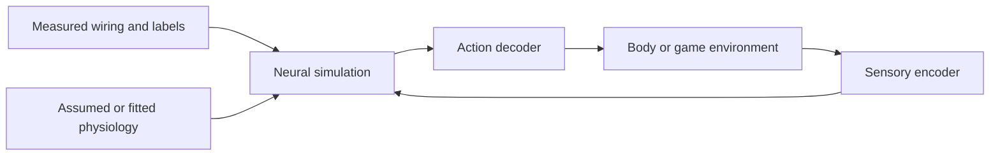

Research brief — fruit-fly connectomics, reviewed 25 September 2026

Google's September 3 announcement concerns **MaleCNS**, an anatomical reconstruction of an adult male fruit fly's central nervous system. The collaboration created an unusually detailed, experimentally grounded starting point for studying neural computation. Executing that anatomy requires additional models of physiology, sensory input, learning and movement. This distinction determines what we can responsibly conclude from downstream experiments. [Google announcement](https://research.google/blog/a-connectomics-milestone-mapping-the-complete-male-fruit-fly-brain/)

This brief reviews primary research, official releases, selected community methods and the original Shiu simulator source. It does not independently reproduce a neural simulation or community game benchmark. The Cell publisher blocked direct full-text retrieval; the published summary was available through search, and the authors' accessible October 2025 preprint supplied detailed methods. Version-specific findings below retain that distinction. Machine-readable provenance is in [source-audit.json](source-audit.json).

The project was led by HHMI Janelia, with Cambridge, MRC LMB and Google Research. Janelia describes Google's contribution as segmentation of electron-microscopy images; expert teams reconstructed, proofread, annotated and classified the neurons. Google also developed Neuroglancer for exploring large volumetric datasets. The scientific result depends on both machine learning and extensive experimental and human reconstruction work. [Janelia project account](https://www.janelia.org/news/researchers-reveal-connectome-of-the-male-fruit-fly-central-nervous-system), [Google announcement](https://research.google/blog/a-connectomics-milestone-mapping-the-complete-male-fruit-fly-brain/)

The release history matters:

| Event | Date | Interpretation |
|---|---|---|
| MaleCNS v0.9 | October 2025 | Initial public connectome; the homepage and release notes disagree on the precise day. |
| MaleCNS v1.0 | June 8, 2026 | Revised proofreading and annotations. |
| Cell publication and Google announcement | September 3, 2026 | Publication/publicity milestone, following earlier public data. |

Dates come from the [project homepage](https://male-cns.janelia.org/) and [release notes](https://male-cns.janelia.org/release/). An experiment predating September 3 can therefore legitimately use these data.

Several distinct resources circulate under the informal phrase “fly brain model”:

| Resource | What it supplies | What we must add or verify |
|---|---|---|
| MaleCNS | Male brain and ventral nerve cord, with anatomy and connections | Neural dynamics and interfaces to an environment |
| FlyWire / FAFB | A different specimen: adult female brain | Dataset-specific IDs, annotations and any body connection |
| BANC | A separate female brain-and-nerve-cord reconstruction | Its own version, provenance and modeling assumptions |
| Shiu model | An executable FlyWire-based spiking model | Whether its validated behaviors cover a proposed use |
| Flybody | Body mechanics, environments and trained locomotion controllers | How a neural circuit actually drives that body |

These are complementary resources, with different specimens and purposes. [MaleCNS](https://male-cns.janelia.org/), [FlyWire](https://flywire.ai/), [BANC paper](https://www.nature.com/articles/s41586-026-10735-w), [Shiu repository](https://github.com/philshiu/Drosophila_brain_model), [Flybody paper](https://www.nature.com/articles/s41586-025-09029-4)

**The reconstruction converts tissue into a graph with anatomical meaning.** The acquisition used a fixed and stained CNS divided into 66 slabs, imaged with seven focused-ion-beam scanning electron microscopes over roughly a year. The earlier optic-lobe paper describes this acquisition for the same specimen. This is destructive anatomical measurement, rather than a recording of a behaving fly. [Nern et al., 2025](https://www.nature.com/articles/s41586-025-08746-0)

After aligning the images, the processing pipeline separates individual neurons, detects synaptic sites and their partners, repairs segmentation errors and assigns biological labels. Flood-filling networks iteratively extend a candidate neuron's segmentation through a three-dimensional image volume. The artificial network here solves an image-reconstruction problem. [Flood-filling network method](https://www.nature.com/articles/s41592-018-0049-4)

The preprint reports 8-nanometre imaging, 160 teravoxels and about 44 person-years of proofreading; the published summary reports approximately 166,700 neurons and 11,710 cell types. Counts vary by version. [Berg et al., preprint methods](https://pmc.ncbi.nlm.nih.gov/articles/PMC12636603/), [published Cell paper](https://doi.org/10.1016/j.cell.2026.08.015)

For engineering purposes, represent the graph as C[j,i], the contact count from neuron j onto neuron i. Twelve contacts between two cells make one directed edge with count twelve. Contact totals and neuron-pair edge totals therefore differ. A presynaptic site can also have several postsynaptic partners. [Official connectivity formats](https://male-cns.janelia.org/download/)

Neurotransmitter labels add useful evidence about signaling, but some are predictions from image classifiers. The foundational 2024 classifier study evaluated six transmitter classes and reported 94% neuron-level accuracy on its evaluated data; that number is not a universal guarantee for every later release. The male optic-lobe pipeline expanded classification to seven classes, including histamine. A predicted transmitter still does not supply the postsynaptic receptor or the entire physiological response. [Eckstein et al., 2024](https://www.repository.cam.ac.uk/items/c285907d-ed80-4dbd-9bd2-a0bd10abd238), [male optic-lobe methods](https://www.nature.com/articles/s41586-025-08746-0)

**The scientific advance is the ability to follow and compare circuits at nervous-system scale.** The published comparison identifies 8,069 isomorphic, 138 dimorphic, 289 male-specific and 71 female-specific types in its comparison set, rather than across all 11,710 CNS types. Differences concentrate in higher integrative centers, with much sensory and motor circuitry shared. [Berg et al., published summary](https://doi.org/10.1016/j.cell.2026.08.015)

My interpretation: this makes the anatomical location of a behavioral divergence experimentally addressable. Researchers can ask where a shared sensory signal enters different downstream circuitry, nominate those neurons for intervention, and test the resulting hypothesis. A graph supports candidate mechanisms; physiological or behavioral experiments determine which mechanisms operate in the animal.

Two companion studies illustrate the immediate value. The visual study traces information from photoreceptors through the optic lobes into central-brain pathways, comparing receptive-field predictions with physiology. The gustatory study maps taste inputs into feeding, foraging, endocrine and social pathways. These are detailed uses of the new anatomy, rather than demonstrations of general game-playing intelligence. [Visual pathways study](https://www.janelia.org/publication/the-organization-of-visual-pathways-in-the-drosophila-brain), [gustatory connectome study](https://www.janelia.org/publication/the-complete-gustatory-connectome-of-adult-drosophila-reveals-how-taste-guides-feeding)

**Coverage, reconstruction quality and behavioral accuracy are different measurements.** The preprint reports about 40.1% connection capture: detected connections whose two ends belong to traced neurons. This measures completeness, not the false-positive rate of retained edges. [Preprint completeness definitions](https://pmc.ncbi.nlm.nih.gov/articles/PMC12636603/)

I checked the official v1.0 capture CSV directly. Its region-level `conn_traced_frac` values include 35.10% for central brain, 42.97% for left optic regions, 53.79% for right optic regions and 37.23% for VNC. The regional differences matter: a lesion experiment's apparent left/right asymmetry could partly reflect reconstruction coverage. These are descriptive source values, not an independently estimated biological error rate. [Versioned capture data](https://github.com/flyconnectome/2025malecns/blob/67767d2233657983993ff6c2be48e836a935863c/supplemental_data/male-cns-v1.0-traced-synapse-capture-by-roi.csv)

One specimen cannot establish population variability. The authors strengthen sex comparisons using cell-type matching and bilateral consistency. [Berg et al., discussion](https://pmc.ncbi.nlm.nih.gov/articles/PMC12636603/)

**A runnable simulation introduces a second scientific object.** The following diagram is my synthesis of the dependencies:



The source data constrain C. The developer chooses or estimates how C participates in computation, what observations become neural input, and what activity means for action. Results depend on this entire loop. Two programs using the same connectome can implement substantially different agents.

A compact model equation makes the missing information visible:

```text
state_next = F(state, C, physiological_parameters, encoded_observation)
action = D(state)
```

Knowing C does not identify F, the physiological parameters, the encoder or D. Structural contact counts are evidence about coupling, but they are not measurements of every synapse's effective electrical influence. The effectome study explicitly addresses that gap with a proposed combination of perturbations, measurements and statistical estimation; its estimator is validated in simulations. [Pospisil et al., 2024](https://www.nature.com/articles/s41586-024-07982-0)

This distinction also separates three meanings of “learning.” Neural activity changing during a run is a state update. Training an action decoder changes the rule that interprets that activity. Changing internal synaptic efficacy according to a plasticity rule changes the circuit model itself. These operations need different evidence. In the equation above, state can change while every model parameter stays fixed. Wiring alone does not specify which experience should update which parameter, in which direction, or for how long.

The original Shiu implementation is especially instructive. Its core behaves approximately as follows:

```text
tau_m * dV_i/dt = V_rest - V_i + g_i
tau_s * dg_i/dt = -g_i
after a spike from j: g_i += alpha * sign_j * C[j,i]
if V_i exceeds threshold: emit a spike, reset and enter refractoriness
```

The inspected code uses common parameters: membrane time constant 20 ms; synaptic decay 5 ms; resting/reset potential −52 mV; threshold −45 mV; delay 1.8 ms; refractory period 2.2 ms; and contact scale 0.275 mV. External activation is injected through Poisson inputs. These are model choices, not per-neuron physiological measurements recovered from the EM volume. [Pinned original implementation](https://github.com/philshiu/Drosophila_brain_model/blob/91bdd1e7dcf193f3e7ca5a8933497fcef63b7960/model.py)

There is a small but relevant documentation distinction: the README describes silencing connections to and from a cell, whereas `silence()` in the inspected code zeros its outgoing weights. A reproduction should specify the actual intervention operator. This does not by itself invalidate the modeling approach. [Original README](https://github.com/philshiu/Drosophila_brain_model), [implementation](https://github.com/philshiu/Drosophila_brain_model/blob/91bdd1e7dcf193f3e7ca5a8933497fcef63b7960/model.py)

Shiu et al. used FlyWire v630, with 127,400 neurons, to study feeding and antennal grooming. They report 91% agreement across 164 experimentally testable predictions; excluding one experiment set dominated by negative outcomes gives 84%. These are task-specific biological validations. The model omits morphology, receptor dynamics, gap junctions, non-spiking signaling, internal state and long-range neuropeptides, and assumes zero baseline firing. Transferring its equations to MaleCNS changes the dataset and coverage; its reported accuracy cannot simply transfer with the code. [Shiu et al., 2024](https://www.nature.com/articles/s41586-024-07763-9)

Another approach is to train unknown parameters under connectome constraints. Lappalainen et al.'s visual model represents 45,669 neurons across 64 cell types, with 734 free circuit parameters under its structural and spatial-sharing assumptions. Training it for optic-flow estimation produced predictions of neural response properties checked against physiology. This is a concrete example of anatomy narrowing a model's search space while learning fills some gaps. It is a partial visual-system model with a separate decoder, not a simulation of the complete MaleCNS. [Lappalainen et al., 2024](https://www.nature.com/articles/s41586-024-07939-3)

Flybody supplies a different piece: a MuJoCo body with walking and flight environments. Its locomotion demonstrations use reinforcement-trained controllers. Therefore, an anatomically realistic moving fly does not alone establish that the connectome generates its limb control. A combined project must disclose the interface and whether a pretrained motor policy handles the movement. [Flybody paper](https://www.nature.com/articles/s41586-025-09029-4)

**Community experiments demonstrate different claims.** I used awesome-fly for discovery and checked selected authors' own methods. This is a focused sample rather than an audit of every listed project. [Community collection](https://github.com/cobanov/awesome-fly)

| Project | What its reviewed materials establish | What remains unestablished |
|---|---|---|
| DOOMFLY | Retained MaleCNS graph, engineered visual/control interfaces, experiments with plasticity | Its current materials explicitly say learned survival has not been demonstrated and validation gates failed. |
| Fly Dino | An 80-cell fixed circuit feeding a trained 243-parameter action network | Its protocol does not test whether the biological topology beats matched artificial or rewired circuits. |
| Eon fly-brain | Multiple implementations and numerical/performance comparisons of a FlyWire LIF model | The repository by itself is not a complete independently validated embodied animal. |

Sources: [DOOMFLY](https://github.com/nftechie/doomfly), [Fly Dino protocol](https://github.com/cobanov/flyjump/blob/main/docs/experiment.md), [Eon simulator](https://github.com/eonsystemspbc/fly-brain).

Fly Dino's distinction is particularly useful: silencing its circuit degrades its trained readout, showing that the computation uses those activities. Its inputs are structured game-state features, and learning changes the artificial readout. This experiment does not isolate what is special about the measured wiring. For that, a comparator must receive the same information and training budget. [Fly Dino methods and controls](https://github.com/cobanov/flyjump/blob/main/docs/experiment.md)

For later work, I would evaluate separate claims with separate tests:

| Proposed claim | Evidence that would support it |
|---|---|
| The circuit affects decisions | Silence or disconnect it while measuring behavior. |
| Training improves performance | Compare trained and initial policies on held-out environments. |
| Plasticity is responsible | Compare learning enabled, frozen weights and scrambled reinforcement. |
| Biological topology helps | Retrain matched rewired/random controls and conventional baselines with equal budgets. |
| Responses resemble a real fly | Compare with relevant neural recordings or biological interventions. |
| The result is stable | Repeat across seeds, input scalings, thresholds and uncertain transmitter assignments. |

This is my proposed evaluation framework. Crucially, a circuit can be necessary for a particular trained decoder without being a better computational substrate than an alternative. Rewiring only after training can destroy almost any learned interface; retraining the controls tests the stronger topology claim.

**The usable data are much smaller than the microscopy volume.** The official release offers neuron annotations (~13 MB), aggregated transmitter predictions (~42 MB) and a full segment-to-segment edge table (~1.1 GB). Synapse locations and individual partner tables are substantially larger. neuPrint supports queries; Neuroglancer supports anatomical inspection. The dataset is CC BY. The edge table includes segments beyond the retained annotated neurons, so a loader needs an explicit inclusion policy. [Downloads and access documentation](https://male-cns.janelia.org/download/)

The original supplementary counting notebook is still configured for **v0.9**. Its saved output gives 25,563,426 edges connecting 166,391 neurons after its superclass filter, and 6,237,402 edges after a five-contact threshold. I inspected those stored outputs; I did not rerun the full graph download. A v1.0 project cannot cite them as freshly verified v1.0 counts. [Pinned counting notebook](https://github.com/flyconnectome/2025malecns/blob/67767d2233657983993ff6c2be48e836a935863c/supplemental_data/quantify-neuron-connections.ipynb)

For comparison, DOOMFLY's own audit reports 166,700 retained candidates, 25,582,938 directed edges and 124,177,617 contacts for its v1.0 inclusion policy. These are the author's audit results, not counts independently recomputed here. The difference illustrates why neuron eligibility, confidence cutoffs and aggregation must accompany every “full graph” claim. [DOOMFLY data audit](https://github.com/nftechie/doomfly/blob/main/docs/doom-neuroscience-review.md)

My storage calculation using that example size: a dense 166,700-square float32 matrix consumes about **111 GB**. A minimal CSR matrix with one float32 weight and one int32 column index per edge plus row pointers is about **205 MB**. These are array-storage estimates, not complete RAM/VRAM requirements. Dynamics, delays, extra states, framework copies and training can cost much more. A full edge sweep every 0.1 ms would visit about 256 billion edges per simulated second; event-driven or reduced models have different costs. Actual speed needs a workload-specific benchmark.

A reproducible implementation should preserve exact integer neuron IDs, pin dataset and annotation versions, record filtering and normalization, identify assumed transmitter signs, and keep simulated time distinct from rendered frames. A 50 Hz animation does not demonstrate a 50 Hz biological simulation. For a circuit subset, document omitted external inputs and boundary effects. These are implementation conclusions from the source audit, not claims that one particular backend already solves them.

The Firebird event describes a 24-hour build sprint ending in a working prototype and live demo. In that setting, my assessment is that the strongest contribution would tie a clear question to a measured circuit and a visible, controlled result. Anatomy exploration, intervention analysis, or a bounded connectome-constrained controller are all supported by this research foundation. A claim of broadly recreated fly intelligence would require substantially more evidence. [Firebird Build](https://hackathon.firebird.ai/)

The main unresolved scientific question for any proposed project is precise: **what explanatory or computational value does the measured wiring contribute after accounting for the encoder, dynamics, readout and training procedure?** MaleCNS makes that question unusually concrete and experimentally approachable.
